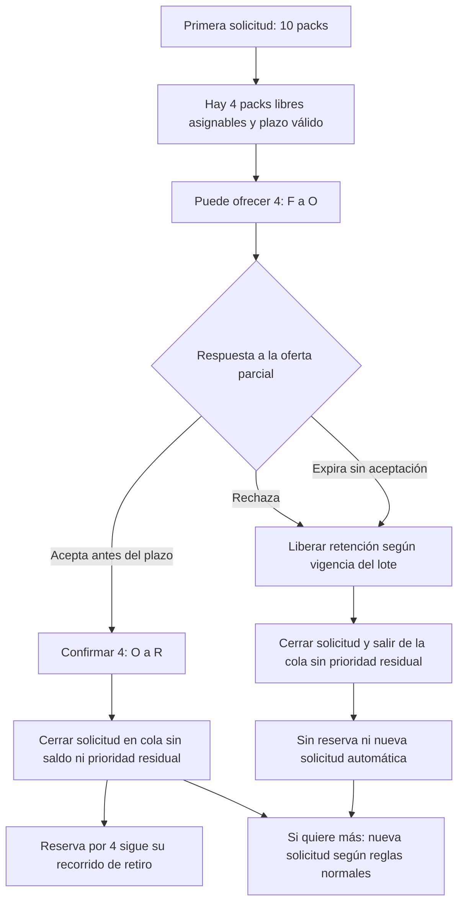

# ADR 0002: ofertas parciales y resolución de la solicitud

Fecha: 2026-09-20. Tipo: decisión de negocio posterior a E1.
Estado: **adoptada para oferta parcial, aceptación, rechazo y expiración** por
instrucción de Producto. El 2026-09-20 se cierra la decisión inicialmente pendiente
sobre rechazo y vencimiento sin respuesta: ambos sacan la solicitud de la cola
sin conservar prioridad y exigen reingreso explícito si se quiere volver a solicitar.

Este documento es la referencia vigente para esta regla. Complementa E1 y
sustituye únicamente la exigencia de esperar cantidad suficiente para satisfacer
íntegramente a la cabeza de cola. Los PDF entregados se conservan como artefactos
históricos. No acredita implementación ni modifica el alcance o esquema de K003.

## Decisión

Si la primera solicitud de la cola pide más unidades de las que actualmente
pueden ofrecerse, el sistema puede realizar una **oferta parcial por la cantidad
disponible a esa primera solicitud**, sin esperar a reunir toda la cantidad
solicitada. Se mantiene el orden FIFO: esta decisión no autoriza a saltarla para
ofrecer a una solicitud posterior.

Toda oferta parcial resuelve la solicitud actual al aceptarse, rechazarse o
vencer sin respuesta. Emitirla no equivale a aceptarla ni resuelve la solicitud
antes de una respuesta o del vencimiento. No existe prioridad residual por la
cantidad originalmente solicitada.

Si la persona acepta la oferta parcial vigente:

1. El compromiso se crea/confirma únicamente por la cantidad efectivamente
   ofrecida y aceptada.
2. La solicitud original se considera satisfecha/cerrada y sale de esa posición
   de la cola.
3. No queda una solicitud residual ni se conserva prioridad por las unidades
   restantes. No se generan nuevas solicitudes automáticamente.
4. Para obtener más unidades, la persona debe realizar una nueva solicitud e
   ingresar según las reglas normales de la cola, sin heredar la posición anterior.

Si la persona rechaza la oferta parcial o esta vence sin respuesta, la solicitud
se cierra y sale de la cola sin conservar prioridad. No se confirma una reserva
ni se genera automáticamente una nueva solicitud al final de la cola. Para
volver a solicitar debe hacerlo explícitamente, con una nueva solicitud y una
nueva posición según las reglas normales de FIFO.

Ejemplo: Ana solicita 10 packs y hay 4 disponibles. Se le pueden ofrecer 4. Si
acepta, queda una reserva por 4, la solicitud por 10 se cierra y no quedan 6 en
espera con la prioridad original. Si después quiere esas 6 unidades, debe hacer
una nueva solicitud sujeta a las reglas normales de admisión.

Cerrar la **solicitud en la cola** no cancela ni vence la **reserva confirmada**:
esta sigue vigente por los 4 packs aceptados y mantiene su recorrido de retiro.
La distinción es de dominio; no prescribe nuevas tablas ni estados SQL. Parcial
significa menos packs que los solicitados, nunca fraccionar un pack indivisible.
Aceptar la oferta de 4 confirma esos 4; este cambio no introduce aceptar solo
una parte de la propia oferta ni retirar parcialmente una reserva.

## Motivo

Con 4 packs libres y solicitudes de Ana por 10, Pedro por 3 y Juan por 1, exigir
las 10 unidades de Ana puede dejar alimentos sin ofrecer. Permitir ofrecerle 4
reduce ese bloqueo por cabeza de cola y favorece el rescate efectivo sin adelantar
a Pedro o Juan. No garantiza que Ana acepte ni que se complete un retiro.

Conservar prioridad después de aceptar parcialmente permitiría pedir cantidades
exageradas (por ejemplo, 100000) y capturar sucesivas ofertas. El ejemplo describe
el incentivo, no autoriza esa cantidad ni elimina las validaciones de RF04.
Resolver la solicitud al aceptar, rechazar o vencer evita convertir su posición
en un derecho permanente. El reingreso explícito mantiene una semántica simple y
consistente con E1, evita el bloqueo por cabeza de cola y conservar prioridad
indefinidamente mediante solicitudes sobredimensionadas.

## Trazabilidad y contradicciones

Las páginas corresponden a la numeración impresa y física de los PDF del repositorio.

| Fuente histórica o viva | Regla o supuesto encontrado | Lectura vigente |
| --- | --- | --- |
| [Informe E1](../entregas/e1/informe-e1.pdf), p. 2 | Se oferta cuando se libera cantidad suficiente; se acepta menor aprovechamiento para mantener el orden estricto. | Se puede ofrecer parcialmente a la cabeza; se conserva el orden, se sustituye la espera obligatoria por cantidad completa. |
| [Anexos E1](../entregas/e1/anexos-e1.pdf), A, p. 2, RF07 | Stock suficiente antes de retener y ofrecer la cantidad; ninguna solicitud posterior se adelanta. | La retención puede ser menor que lo solicitado; no se elimina la prioridad FIFO. |
| Anexos B, p. 4 | Oferta de espera: «Conserva cantidad completa»; Compromiso guarda una cantidad. | Se retiene la cantidad ofrecida. Cantidad solicitada, ofrecida y confirmada ya no son necesariamente iguales; su representación futura debe preservar trazabilidad. |
| Anexos H, p. 20, Espera y prioridad | «Si la primera cantidad no cabe, se espera hasta liberación o cierre. No hay adelantos.» | Se sustituye la espera obligatoria; no hay adelantos por esta decisión. |
| Anexos F, p. 8; B, p. 4 | Compromiso abarca espera, oferta y confirmación en un mismo ciclo. | Cierre de la demanda en cola y vigencia de la reserva aceptada deben distinguirse; no se marca terminal la reserva por aceptar parcialmente. |
| [Modelo inicial](../modelo-inicial.md), entidad y cantidades de `commitments` | Describe `quantity` como packs solicitados y solo admite `confirmed`. | Para un compromiso confirmado representa los packs comprometidos; tras una oferta parcial son los aceptados, no la solicitud original. Aclaración documental posterior a E1, sin cambio SQL. |
| Anexos G, M04, p. 14 | La maqueta promete volver a la espera al rechazar. | El propio pie de E1 corrige esa promesa: nueva acción y posición. No es evidencia a favor de conservar prioridad. El reingreso explícito se aplica también a ofertas parciales por esta decisión posterior. |

No se encontró una regla que permitiera conservar saldo prioritario después de
aceptar parcialmente: E1 no contemplaba ese flujo. Su prohibición es parte de
esta nueva decisión, no una corrección atribuida retroactivamente a E1.

## Rechazo, expiración y ausencia de respuesta

**Lo que E1 define inequívocamente para sus ofertas completas:**

- Informe p. 2: rechazar termina el compromiso; volver a la espera requiere una
  nueva solicitud.
- Anexos A, RF07, p. 2: rechazar o dejar vencer termina el compromiso;
  reingresar requiere acción explícita y una nueva posición.
- Anexos p. 10, nota de la figura 2: al rechazar o vencer termina el compromiso;
  la cantidad solo se vuelve a ofrecer con el lote vigente.
- Anexos G, M04, p. 14: corrige expresamente el retorno a la espera que promete
  la maqueta y condiciona la reasignación a lote vigente y solicitud elegible.
- Anexos A, RF08, p. 2, y H, pp. 20 y 23: no responder deja transcurrir el plazo;
  al vencer ya no se acepta, aunque el trabajador esté detenido. No hay en E1
  una prórroga por desconexión ni por falta de lectura del aviso.

**Cierre de la decisión posterior a E1 (2026-09-20):** se extiende expresamente
esa semántica a las ofertas parciales. La revisión inicial dejó abierta su
aplicación porque E1 contemplaba ofertas completas; Producto acuerda ahora la
misma salida de la cola y el reingreso explícito, sin prioridad residual.

| Caso de oferta parcial | Resolución de la solicitud y posición |
| --- | --- |
| Aceptación vigente | Confirmar solo la cantidad ofrecida y aceptada; cerrar la solicitud y salir de la cola sin saldo prioritario. |
| Rechazo explícito | Cerrar la solicitud y salir de la cola sin conservar prioridad; no crear una reserva ni una nueva solicitud automática. |
| Expiración sin respuesta | La oferta deja de ser aceptable; cerrar la solicitud y salir de la cola sin conservar prioridad ni generar otra solicitud. |
| No responde mientras sigue vigente | No hay aceptación ni cierre anticipado por silencio; al vencer se aplica la resolución anterior, sin prórroga. |

En todos los desenlaces, volver a solicitar exige una acción explícita, una
nueva solicitud y una nueva posición según las reglas normales de FIFO. Se
descartan las alternativas de conservar la posición o trasladar automáticamente
la solicitud al final. No queda una decisión pendiente sobre rechazo o expiración
de ofertas parciales. La representación futura del reingreso en el modelo se
trata como riesgo de K003 más abajo.

## Cantidades, inventario y plazos

Se conservan las reglas de B p. 4: Q = F + O + R + E + X, contadores no negativos,
Q publicada inmutable, espera sin posesión de packs y ausencia de sobreasignación.
Disponible para ofrecer significa stock libre asignable tras comprobar vigencia,
retenciones, reservas y prioridad; no es toda Q ni incluye packs ya ofrecidos.

| Acción | Efecto de una oferta parcial por 4 sobre una solicitud de 10 |
| --- | --- |
| Ofrecer | Mover solo 4 de F a O. Los 6 no ofrecidos no se retienen ni se reservan. |
| Aceptar vigente | Mover esos 4 de O a R, sin descontar F otra vez. Cerrar la solicitud en cola sin saldo prioritario. |
| Liberar una oferta rechazada o vencida | Solo su cantidad retenida deja O: vuelve a F si el lote sigue vigente o pasa a X si ya no es asignable. La solicitud sale de la cola sin prioridad residual ni reingreso automático. |
| Cancelar/vencer la reserva o acreditar retiro | Operar sobre los 4 confirmados según las reglas existentes, nunca sobre los 10 solicitados ni sobre un saldo ficticio de 6. |

Con Q=10, F=4 y R=6 de otras reservas (O=E=X=0), ofrecer 4 deja F=0, O=4, R=6;
aceptar deja F=0, O=0, R=10. Q sigue siendo 10. No se modifica la cantidad publicada
del lote para reflejar una oferta parcial.

H p. 20 conserva duración de oferta de 10 minutos o hasta cierre, lo que ocurra
primero, y prohíbe ofrecer con menos de un minuto restante. La oferta parcial
no renueva el cierre del lote. C y H pp. 5/23 mantienen comprobación de tiempo
y estado bajo bloqueo e idempotencia; API y trabajador deberán compartir reglas.
Nada de esto se implementa en esta revisión.

## Recorrido vigente y diagramas

Este complemento de la figura 2 (anexos p. 10) describe únicamente la nueva rama;
las reservas directas conservan sus condiciones. No se reemplaza el dibujo histórico.

La figura 4 (H p. 23, último pack) sigue siendo válida: espera por bloqueo,
relectura y una sola asignación. Las figuras de arquitectura del informe p. 3 y
anexos p. 10 no requieren cambios. El ER de K003 describe persistencia actual,
no una máquina de ofertas; no se agregan entidades hipotéticas.

Las vistas futuras M02/M03/M04/M05/M06 (G pp. 12–16) deberán distinguir cantidad
solicitada, ofrecida y confirmada. Antes de aceptar, M04 debe explicar que aceptar
4 cierra la solicitud de 10 sin prioridad por 6; M03/M06 muestran 4 comprometidos
y retirables. M05 separa personas en espera de packs. Los mensajes sobre rechazar
o dejar vencer una parcial deben explicar que la solicitud sale de la cola sin
conservar prioridad y que volver a solicitar exige una nueva acción explícita.
No deben prometer reingreso automático.

## Impacto en K003 y trabajo futuro

K003 conserva cinco tablas y únicamente compromisos `confirmed`. Su cantidad
entera positiva permite representar una reserva por 4, pero no conserva por sí
sola las cantidades 10 solicitadas y 4 ofrecidas, el cierre de la solicitud ni su
posición. Tampoco implementa contadores, ofertas o transiciones. El SQL, pruebas,
historial y evidencia de K003 permanecen intactos.

RF04 limita a un compromiso activo por usuario/lote; K003 aplica actualmente
`commitments_active_user_lot_key` a un compromiso **confirmado** por usuario/lote. Aceptar parcialmente deja una reserva activa; no concede por sí
solo permiso para abrir simultáneamente otro compromiso activo sobre el mismo
lote. **Riesgo futuro de compatibilidad:** el modelo de solicitud/oferta/reingreso
deberá resolver cómo representar solicitudes posteriores sobre el mismo lote,
incluido el caso en que la reserva anterior siga activa, y su convivencia con RF04.
La nueva solicitud se sujeta a las reglas normales y nunca hereda prioridad.
Este riesgo no reabre la decisión de salida de la cola por rechazo o expiración.
No se relaja el índice actual ni se fija un esquema futuro.

El repositorio no contiene un catálogo completo de tarjetas futuras con sus IDs.
Se registran impactos por RF y semanas del informe p. 5, sin inventar números K:

| Trabajo futuro | Impacto y aceptación que deberá incorporar |
| --- | --- |
| Reservas y cancelaciones, RF04/RF05, S2–S3 | Confirmar/cancelar solo la cantidad aceptada; distinguir demanda original de reserva; revisar unicidad activa e idempotencia. |
| FIFO, espera y motor de ofertas, RF07, S5 | Ofrecer 4 a la primera solicitud de 10; no adelantar a Pedro o Juan; cerrar al aceptar, rechazar o vencer sin prioridad residual; reingreso nuevo explícito, nunca automático. |
| Vencimientos, RF08, S4 y aceptación en S5 | Probar antes/en/después del plazo, liberar solo lo retenido; al vencer sacar la solicitud de la cola sin prioridad ni nueva solicitud automática. |
| Inventario y reserva transaccional, S3 y posteriores | Conservar Q/F/O/R/E/X; mover cantidad ofrecida/aceptada, sin doble descuento; carreras de aceptación, expiración, cancelación y cierre. |
| Worker y avisos, RF08/RF09, S6 | Compartir reglas con API, recuperar tareas sin reofertas/efectos duplicados; comunicar cantidades y consecuencias decididas. |
| Panel, retiro y métricas, RF06/RF10/RF12, S4/S6/S8 | Mostrar y acreditar packs realmente confirmados/retirados, no sumar demanda descartada como rescate. |
| Contratos y vistas, K009/K011; recorrido integrado, K012 | Revisar alcance de sus contratos y escenarios al incorporar ofertas; no añadir ahora endpoints ni UI. K004 solo propone identidad/lotes. |
| Regresión y recuperación, S9 | Añadir casos de oferta parcial, reintento y nueva solicitud sin prioridad heredada; conciliar cantidades e historial. |

Caso futuro obligatorio: Ana 10, Pedro 3, Juan 1, libres 4. Ofrecer 4 a Ana y
aceptar confirma exactamente 4; Ana sale de esa posición, sin solicitud residual.
Si posteriormente puede reingresar por 6 según las reglas de admisión, obtiene
una posición nueva detrás de quienes sigan esperando. Reintentar la aceptación
no crea otra reserva ni otro movimiento. En escenarios alternativos, rechazar
la oferta o dejarla vencer sin respuesta saca a Ana de la cola, libera solo los
4 retenidos según vigencia y no crea otra solicitud. Si Ana quiere volver a
solicitar, debe hacerlo explícitamente y obtiene una nueva posición. Reintentar
el rechazo o procesar otra vez el vencimiento no duplica liberación ni reingreso.
Estos son criterios documentados, no pruebas ejecutadas ni tarjetas implementadas.

## Documentación revisada antes de editar

- Informe E1 completo (5 páginas) y anexos A–I completos (28 páginas), incluyendo
  RF, glosario, modelo, inventario, maquetas, diagramas y notas normativas. Se
  extrajo el texto directamente con PyMuPDF y se inspeccionaron visualmente
  las páginas 10, 14 y 23 de anexos para los diagramas y la maqueta afectada.
- `README.md`, `docs/README.md`, `docs/modelo-inicial.md` y
  `docs/contrato-api.md`: fuentes vivas, alcance y cantidades.
- `docs/k003-evidencia.md`, `docs/migraciones.md` y
  `docs/adr/0001-gestor-de-migraciones.md`: persistencia y evidencia histórica;
  no definen una política posterior de ofertas.
- `docs/desarrollo-local.md`, `docs/verificacion-k006.md`,
  `docs/k005-fotos.md`, `docs/k005-evidencia.md`: infraestructura, fotos y sus
  vencimientos, sin otra regla de posición en cola.
- `web/src/services/README.md`, `api/fixtures/README.md` y plantilla de PR:
  sin reglas adicionales. El README raíz enlaza un archivo ausente,
  `docs/verificacion-navegacion-web.md`; no se lo considera evidencia revisada.
- Búsqueda transversal en archivos versionados y lectura de la migración inicial
  para verificar restricciones de K003. No hay otros documentos de casos de uso,
  diagramas editables separados ni un tablero completo de tarjetas en este árbol.

La revisión y los cambios son exclusivamente documentales. La documentación
técnica histórica no se convierte en evidencia de ejecución de esta nueva regla.
