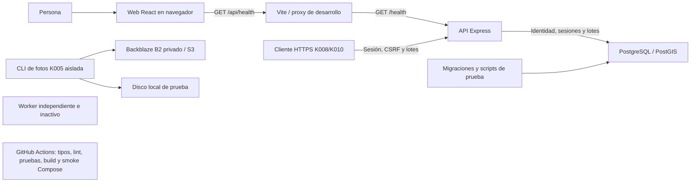
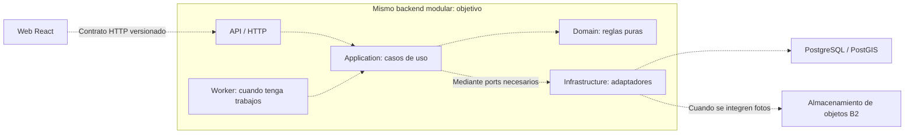

# Arquitectura de Rescate

Fecha de revisión: 2026-09-21, integración K008 con K010 en el árbol de trabajo.
Estado: K008 y K010 implementados; pantallas de negocio y restantes operaciones pendientes.
Decisión: [ADR 0003](../adr/0003-arquitectura-incremental-s02.md).

Este documento separa el código existente del diseño que guiará S02. No acredita
funcionalidades por el solo hecho de describirlas. La adopción arquitectónica
original fue documental. La revisión posterior del
contrato incorpora [OpenAPI S02](../api/README.md). K010 materializa HTTP,
Application, Domain, Infrastructure y Composition para lotes con PostgreSQL.

## Fuentes y relación con E1

Se inspeccionaron README, documentación de S01, ADR 0001/0002, modelo, contrato
preliminar, `api/src`, `web/src`, migraciones, scripts, Compose y CI. Para el estado
actual prevalece el código; los registros de pruebas anteriores conservan su fecha
y no equivalen a una ejecución nueva.

También se leyó directamente el texto completo del [informe E1](../entregas/e1/informe-e1.pdf)
(5 páginas) y de sus [anexos](../entregas/e1/anexos-e1.pdf) (28 páginas), extraído
con PyMuPDF instalado temporalmente fuera del proyecto. Se inspeccionaron
visualmente el informe p. 3 y los anexos p. 10 para verificar los diagramas.
La extracción tiene algunas ligaduras defectuosas; no se afirma haber revisado
visualmente todas las maquetas. No se modificaron los PDF.

| Fuente directa | Relación con esta decisión |
| --- | --- |
| Informe pp. 3–4 | Propone monolito modular, PostgreSQL/PostGIS, objetos y trabajador con reglas compartidas. Las cuatro responsabilidades internas de este documento detallan esa dirección; no se atribuyen literalmente a E1. |
| Anexos C p. 5 y H p. 23 | Operaciones críticas coordinadas bajo transacción, mismo cliente PostgreSQL, relectura tras bloqueo y ausencia de llamadas externas bajo bloqueo. Son diseño para futuras operaciones, no capacidades actuales. |
| Anexos H p. 21 | Ya define contraseña con scrypt, sesión opaca persistida en PostgreSQL, plazo de 12 horas, cookie HttpOnly/Secure/SameSite Lax, token CSRF y validación de origen. K008 lo materializa; no se considera indeciso por el texto preliminar de K004. |
| Anexos I pp. 24–25 y 27 | Migraciones versionadas, fotos opcionales en objetos y copias separadas. ADR 0001 concreta el gestor y K005 documenta el prototipo B2. |
| Informe p. 5 y anexos E p. 7 | E2 prevé modelos, arquitectura, Walking Skeleton, fotos, CI y migraciones; no demuestra su cumplimiento actual. |

Los módulos de negocio de E1 (Identidad, Publicaciones, Asignación,
Comunicaciones y Operación) agrupan capacidades. HTTP, Application, Domain e
Infrastructure separan responsabilidades técnicas dentro del backend; son ejes
distintos, no nueve capas ni nueve servicios. Se incorporarán módulos cuando las
tarjetas los necesiten, sin crear anticipadamente todas sus carpetas.

[ADR 0001](../adr/0001-gestor-de-migraciones.md) mantiene node-pg-migrate, SQL y pg.
[ADR 0002](../adr/0002-ofertas-parciales.md) prevalece sobre la espera por cantidad
completa de E1: permite oferta parcial a la cabeza FIFO y cierra la solicitud al
aceptar, rechazar o vencer, sin prioridad residual ni reingreso automático. Esta
regla tampoco está implementada. No se reabren esas decisiones con este documento.

## A. Arquitectura implementada actualmente

### Sistema actual: entorno de desarrollo

Las flechas continuas representan caminos existentes en código/configuración,
no una nueva comprobación de servicios en ejecución. K010 conecta HTTP con PostgreSQL; B2 y worker siguen aislados. CI es automatización de
verificación, no un servicio usado por una persona.



Vite sirve la web y reenvía `/api` eliminando ese prefijo. El diagrama muestra el
recorrido de la consulta iniciada desde el navegador, no cuatro servidores:
React se ejecuta en el navegador. En host el destino predeterminado es
`http://localhost:3000`; Compose configura `http://api:3000`. No describe un proxy
HTTPS de producción ni un despliegue público ya disponible.

| Componente | Evidencia real y alcance |
| --- | --- |
| Web | [App.tsx](../../web/src/app/App.tsx) define navegación y pantallas de demostración. [ConnectionPage.tsx](../../web/src/pages/ConnectionPage.tsx) usa [http-client.ts](../../web/src/services/http-client.ts) para comprobar `/health`. [K009](../k009-evidencia.md) integra registro y sesión; [K011](../k011-formulario-lotes.md) el borrador y la publicación de lotes del operador. |
| Proxy | [vite.config.ts](../../web/vite.config.ts) configura el proxy de desarrollo mediante `API_PROXY_TARGET`. La base del cliente se configura con `VITE_API_BASE_URL`. |
| API | [app.ts](../../api/src/app.ts) expone salud, cuatro rutas auth y cuatro de lotes. [Composition](../../api/src/composition.ts) ensambla Pool, repositorio, casos de uso y router. K008 aporta credenciales, sesiones persistentes y protección HTTP. |
| Base | [compose.yaml](../../compose.yaml) declara `postgis/postgis:16-3.5` y volumen persistente. Las [migraciones](../../api/migrations) definen la tabla técnica K002 y las cinco tablas de K003: users, establishments, memberships, lots y commitments. K008 añade credenciales, sesiones y protección de login; commitments sigue sin flujo implementado. |
| Migraciones y scripts | [package.json](../../api/package.json) expone node-pg-migrate; [test-migrations.mjs](../../api/scripts/test-migrations.mjs) consulta PostgreSQL con pg y verifica integridad/historial. [El wrapper Compose](../../api/scripts/test-migrations-compose.mjs) crea una base de prueba desde template0 en el servidor existente; esa base no hereda PostGIS. No hay consultas espaciales en la API. |
| Worker | [worker.ts](../../api/src/worker.ts) registra inicio, mantiene vivo el proceso y maneja señales. No consulta la base, no hace polling ni ejecuta trabajos. Comparte paquete e imagen con API, pero es otro proceso. |
| Fotos | [CLI](../../api/src/prototypes/photos/cli.ts), [adaptador local](../../api/src/prototypes/photos/local.ts) y [smoke S3](../../api/src/prototypes/photos/s3.ts) operan un fixture conocido. El [registro K005](../k005-evidencia.md) documenta pruebas previas reales en B2; no es integración de fotos de lotes ni procesamiento de entradas de usuarios. |
| CI | [ci.yml](../../.github/workflows/ci.yml) configura tres jobs: web (tipos/lint/build), API (OpenAPI/tipos generados/tests HTTP y Domain/build) y Compose (configuración, imágenes, arranque, web/API/proxy, PostGIS, migraciones y publicación concurrente K010, worker). No prueba login, no ejecuta el smoke remoto B2 ni despliega producción. |

**Conexiones todavía ausentes:** API HTTP → B2,
worker → base/casos de uso, web → operaciones de identidad/lotes. Compose no
ejecuta migraciones al arrancar. Inyecta DATABASE_URL a API, no al worker.
`/health` comprueba el proceso HTTP, no la base; esa diferencia frente a la salud
propuesta en anexos H p. 22 queda pendiente de integración futura.

La estructura real añade `http/`, `application/lots/`, `domain/`,
`infrastructure/postgres/` y `composition.ts` para K010; conserva `app.ts`,
`index.ts`, `worker.ts` y `prototypes/photos/`. Web tiene `app/`, `components/`, `pages/`, `services/` y
`types/`, además de `styles/` y primitives en `components/ui/` tras la integración
visual compartida. La [guía de frontend](../../web/README.md) describe esa base,
la sesión K009 y el formulario de lotes K011. Los dos archivos de tipos preliminares,
[services/api-types.ts](../../web/src/services/api-types.ts) y
[types/api.ts](../../web/src/types/api.ts), aún existen y no son un contrato
definitivo ni modelos de persistencia. Se marcan como antecedentes históricos;
K011 introduce tipos web generados desde OpenAPI; la sustitución de los tipos
manuales K009 y K004 queda como deuda registrada en [K011](../k011-formulario-lotes.md).

## B. Arquitectura objetivo incremental para S02

### Arquitectura objetivo incremental S02

Se adopta un monolito modular/simple. Se conserva una API y el worker como
proceso del mismo backend. Las flechas discontinuas son integraciones futuras:
S02 incorporará las necesarias para sus tarjetas; objetos y trabajos se conectarán
cuando corresponda a su alcance, no por aparecer en este diagrama.



Este es un diagrama de colaboración en ejecución. La flecha Application →
Infrastructure representa invocar una dependencia inyectada, **no importar su
implementación concreta**. En API y worker se crean instancias propias de los
casos de uso; compartir código no significa compartir memoria entre procesos.

No se agregan microservicios, broker, Redis, event bus, ORM, framework de
repositorios ni contenedor de inyección. Tampoco se requiere una clase por entidad
o una interfaz por función. Los ports son límites tipados que se usan cuando
separar persistencia, criptografía u otra dependencia aporta valor; no otra capa.

### Responsabilidades internas

| Responsabilidad | Hace y puede conocer | No debe hacer ni conocer |
| --- | --- | --- |
| **HTTP** | Rutas, handlers/controllers ligeros, middleware HTTP, parsing y validación estructural, lectura/escritura de cookies, DTO HTTP y traducción de resultados/errores. Puede conocer Express y casos de uso de Application. | SQL, pg, AWS SDK/B2 directamente o reglas centrales del negocio. |
| **Application** | Casos de uso, coordinación, autorización y definición de atomicidad. Conoce Domain, ports necesarios, actor autenticado y tipos propios de aplicación. | req/res de Express, cookies concretas, códigos/detalles HTTP, pg.Pool o SDK B2/S3. No importa adaptadores concretos. |
| **Domain** | Invariantes y decisiones puras independientes de tecnología. Funciones y tipos sencillos bastan; clases solo si ayudan. | HTTP, Express, Application, Infrastructure, SQL/PostgreSQL, variables de entorno, B2 o filesystem. |
| **Infrastructure** | PostgreSQL, repositorios concretos, hashing/criptografía, persistencia de sesiones, objetos S3/B2 y otros adaptadores. Implementa los ports requeridos y conoce sus librerías. | Decidir quién publica, quién está autorizado o qué transición permite el negocio. |

La validación estructural responde si la entrada tiene la forma esperada; una
invariante responde si la operación es válida para el negocio. Application
comprueba autorización usando actor y datos obtenidos mediante ports; Domain
puede expresar una política pura y el repositorio ejecutar una consulta filtrada,
pero ni un filtro SQL ni ocultar un botón sustituyen la autorización del caso de uso.
Un actor autenticado no es un `Request` ni un permiso general sobre todo objeto.

### Composition: ensamblaje, no quinta capa de negocio

Un futuro `api/src/composition.ts` leerá y validará configuración, creará el Pool
PostgreSQL, construirá adaptadores concretos y casos de uso, conectará los ports
con sus implementaciones y entregará dependencias a HTTP o al worker. Cada
proceso tendrá su ciclo de arranque y cierre de recursos. No contendrá políticas
de negocio ni se importará desde Domain/Application como localizador global.

Puede importar las piezas que ensambla, incluidas las concretas. Bastan funciones
constructoras y parámetros explícitos; no hace falta un contenedor de dependency
injection. No se implementa `composition.ts` en este PR.

### Organización futura orientativa

Las siguientes rutas son una guía para código nuevo, **no archivos existentes ni
carpetas que haya que crear ahora**. Se ajustarán al tamaño real de cada tarjeta.

```text
api/src/
  http/                 rutas, middleware y traducción HTTP
  application/          casos de uso y sus ports cercanos al consumidor
  domain/               reglas y tipos puros
  infrastructure/       adaptadores PostgreSQL, criptografía y objetos
  composition.ts        ensamblaje explícito
  index.ts              entrada del proceso API
  worker.ts             entrada del proceso worker
```

Dentro de estas responsabilidades se pueden agrupar identidad y publicaciones
cuando crezcan. No se impone una matriz de carpetas vacías por módulo/capa.
`app.ts` y el prototipo K005 conservan su ubicación actual; cualquier adaptación
posterior debe responder a una integración real y quedar en su tarjeta.

### Reglas de dependencia verificables

1. HTTP puede depender de Application. Pasa entradas de aplicación y recibe
   resultados, sin propagar `req`, `res` ni objetos de cookies.
2. Application depende de Domain y de ports necesarios definidos junto al caso
   de uso o en un archivo de contratos de aplicación. No importa Express, pg,
   SDK de almacenamiento ni adaptadores concretos de Infrastructure.
3. Infrastructure implementa esos ports. Puede importar sus tipos y los tipos
   de dominio necesarios para mapear datos. No decide políticas de autorización.
4. Domain no depende de HTTP, Application ni Infrastructure. Sus reglas reciben
   valores explícitos, por ejemplo el instante relevante, sin leer entorno/reloj
   global para decidir por su cuenta una vigencia.
5. HTTP no ejecuta SQL. Domain no importa infraestructura. La creación de
   adaptadores concretos queda en Composition, fuera de los casos de uso.
6. Worker reutilizará casos de uso de Application cuando tenga trabajo real;
   no duplicará reglas ni llamará a la API HTTP local para ejecutarlas.

**MAL:** `auth.routes.ts` importa pg y ejecuta `SELECT`; decide además cómo
verificar contraseñas y crear sesiones. **BIEN:** la ruta llama a `login()`;
Application coordina verificación y sesión mediante ports, y una implementación
PostgreSQL satisface la persistencia necesaria.

**MAL:** un repositorio permite publicar porque encontró una membresía y cambia
el estado por iniciativa propia. **BIEN:** el caso de uso obtiene la información,
comprueba permisos, aplica reglas de publicación y solicita la escritura acordada.

**MAL:** el worker copia la política de vencimiento o usa HTTP contra localhost.
**BIEN:** su entrada invoca el mismo caso de uso que utiliza la API cuando proceda.

Estas reglas se revisan mediante imports, llamadas y pruebas del comportamiento;
los nombres de carpetas no prueban su cumplimiento. Los scripts de migración y
el prototipo aislado tienen propósitos técnicos propios: no se les exige aparentar
casos de uso de producto. No se introduce un verificador automático en este PR.

### Ejemplos futuros de responsabilidades

Los ejemplos de esta sección ilustran el objetivo; las firmas reales K010 están
en [lotes](../../api/src/application/lots/use-cases.ts) e [identidad](../../api/src/application/identity/use-cases.ts).

| Ejemplo | Ubicación responsable | Motivo |
| --- | --- | --- |
| Login | Application, invocado por HTTP | Coordina búsqueda de cuenta, verificación y sesión sin conocer Express. |
| Hashing/verificación | Infrastructure detrás de un port | Encapsula scrypt, sal y parámetros técnicos; la política de contraseña no se decide en el adaptador. |
| Creación de sesión | Application coordina; Infrastructure genera el secreto y persiste | El caso de uso define cuándo corresponde y su vigencia; HTTP emite la cookie. |
| Lectura de cookie | HTTP | Extrae la credencial de transporte; Application resuelve la sesión mediante el port, sin recibir cookies concretas. |
| Autorización por establecimiento | Application con políticas puras de Domain si hacen falta | Usa actor y pertenencia real para autorizar la operación sobre ese establecimiento. |
| Creación de borrador | Application + Domain | El caso de uso coordina permisos/persistencia; funciones puras comprueban las reglas de los datos. |
| Publicación | Application + Domain | Coordina lectura/escritura atómica y autorización; Domain decide las condiciones y transición válida. |
| Query PostgreSQL | Infrastructure | SQL parametrizado y mapeo de filas a tipos propios, sin devolver objetos pg al caso de uso. |
| Acceso B2 | Infrastructure detrás de un port cuando se integre | Encapsula SDK, claves y operaciones; Application decide si se concede el acceso. |
| Error de dominio a HTTP | HTTP | Traduce un resultado semántico al contrato HTTP sin contaminar Domain. |

### Transacciones

**Application decide qué operación debe ser atómica. Infrastructure proporciona
el mecanismo concreto para ejecutarla dentro de una transacción PostgreSQL.**
`BEGIN`, `COMMIT`, `ROLLBACK`, adquisición/liberación del cliente y consultas son
infraestructura. Los ports no exponen `pg.Pool` ni clientes pg a Application.

Por ejemplo, al implementar publicación se deberá delimitar en su caso de uso
qué lectura/validación de versión y cambio de estado deben confirmarse juntos;
un repositorio no debe confirmar por separado pasos que forman esa unidad.
Infrastructure ejecutará los pasos acordados usando el mismo cliente durante
la transacción, revertirá ante fallo y liberará recursos. Solo se informa éxito
después del commit. Los detalles de concurrencia se concretarán en la tarjeta.

No se diseña aún un framework genérico de Unit of Work. El primer caso real
determinará un contrato mínimo para la operación atómica. Para operaciones
críticas posteriores se conserva el protocolo de E1: bloquear, releer estado y
tiempo después de esperar, aplicar reglas y confirmar efectos juntos. No hacer
llamadas externas a B2 dentro del bloqueo; una transacción PostgreSQL no revierte
objetos remotos. Las fotos requerirán coordinación y limpieza explícitas cuando
se integren, según el diseño de E1, no una transacción distribuida implícita.

### Errores

Domain y Application pueden producir errores semánticos propios, por ejemplo
una transición no permitida o falta de autorización. Se podrán representar como
resultados o errores tipados sencillos. HTTP los traducirá a códigos y cuerpos
acordados en el contrato; no se establece aquí un catálogo exhaustivo.

Infrastructure puede reconocer restricciones conocidas o fallos técnicos para
comunicarlos mediante el port, pero no decide arbitrariamente que un resultado
es 403, 404 o 409. El tratamiento depende del caso de uso y del contrato HTTP.
Los errores inesperados se traducen a una respuesta controlada sin SQL, stack,
credenciales, cookies ni URLs firmadas. Los detalles de diagnóstico deben quedar
fuera de la respuesta pública y sin secretos. El catálogo se define en
la [guía OpenAPI](../api/README.md); su mapeo concreto se probará en las tarjetas.

### Contratos HTTP y OpenAPI

**[OpenAPI S02](../api/openapi.yaml) es la fuente de verdad HTTP entre web y API.**
Se adopta antes de K008/K010: ocho operaciones, requests, responses, errores y
seguridad, con validación estructural/de ejemplos en CI. La [guía](../api/README.md)
registra decisiones y límites. K010 genera DTO del YAML y prueba respuestas HTTP
con Ajv 2020-12; Redocly verifica estructura/ejemplos. K008 prueba sesión/CSRF con PostgreSQL, reinicio real de API y Chromium HTTPS.

| Fuente de verdad | Qué define |
| --- | --- |
| OpenAPI S02 | Superficie HTTP versionada: operaciones, esquemas de transporte, respuestas y seguridad. |
| Domain y documentación de negocio/ADR | Invariantes, autorización, transiciones y decisiones que OpenAPI no expresa bien. Hoy muchas reglas solo están documentadas. |
| Migraciones SQL | Persistencia: tablas, columnas, restricciones, índices y evolución del esquema. |

OpenAPI **no es el modelo de base de datos**. K010 deriva sus tipos HTTP
con `npm --prefix api run api:types` y comprueba su sincronización en CI. Los tipos propios de
Application/Domain y el mapeo de persistencia pueden seguir siendo explícitos:
no son catálogos alternativos de DTO HTTP.

No mantendremos múltiples catálogos manuales de tipos HTTP como fuentes de
verdad paralelas. Al adoptar generación se revisarán consumidores y se
sustituirán/consolidarán los dos conjuntos preliminares de web; no se editarán
tipos generados a mano. La generación de tipos tampoco sustituye validación de
datos en ejecución. La herramienta, ubicación y checks se decidirán entonces.

[contrato-api.md](../contrato-api.md) se conserva como **antecedente/propuesta
K004**, sustituido como referencia HTTP por OpenAPI S02. Su incertidumbre
histórica sobre cookies no anula H p. 21; las decisiones resueltas están en
la guía del contrato.

## Cómo demostrar esta arquitectura en E2

Propuesta de evidencia, respaldada por el código existente en el commit que se
presente. La indicación de detallar capas, responsabilidades y contratos proviene
de la instrucción de este PR; no se atribuye a una pauta del profesor no revisada.

1. **Contexto del sistema:** actores, límites, web, API, base y servicios externos;
   distinguir despliegue local de propuestas de producción.
2. **Componentes y conexiones:** actualizar los dos diagramas, marcar qué se
   implementó y enlazar archivos reales. Una flecha prevista no es evidencia.
3. **Responsabilidades y dependencias:** mostrar un handler ligero, un caso de
   uso, una regla pura, su adaptador y el ensamblaje, solo cuando existan. Revisar
   imports para comprobar que Domain no depende de tecnología.
4. **Contratos:** enlazar el OpenAPI versionado y, cuando existan handlers, contrastar
   una request/response real, su seguridad y errores. Relacionar el DTO con tipos de
   aplicación y persistencia sin confundirlos. K010 prueba respuestas reales
   contra schemas OpenAPI; K008 agrega seguridad de sesión y CSRF.
5. **Recorrido trazable:** documentar la secuencia web → HTTP → Application →
   Domain/port → Infrastructure → PostgreSQL de una operación ya integrada de
   S02. Mostrar autorización, atomicidad y traducción de error donde corresponda.
   K010 demuestra HTTP de lotes con repositorio en memoria y, por separado,
   Application/Infrastructure con PostgreSQL real; K008 agrega navegador HTTPS autenticado.
   K011 agrega el recorrido web → HTTP de lotes en Chromium con PostgreSQL real.
6. **Pruebas y operación:** asociar reglas puras con sus pruebas, casos de uso con
   sus escenarios y adaptadores con integración real. Adjuntar comandos,
   entorno, commit y resultado observado; distinguir pruebas nuevas de registros
   S01. Mostrar CI y migraciones; el smoke B2 aislado no demuestra fotos integradas
   y un worker vivo no demuestra trabajos procesados.
7. **Brechas y decisiones:** mantener tabla de requisito/decisión → archivo →
   prueba/evidencia → estado. Registrar lo pendiente y las desviaciones con motivo,
   sin rellenar con carpetas vacías o diagramas de capacidades inexistentes.

Ejemplo de trazabilidad que ya puede mostrarse:

| Evidencia | Código/documento real | Qué demuestra y qué falta |
| --- | --- | --- |
| Web → API | ConnectionPage, proxy, app.ts y [health.test.ts](../../api/test/health.test.ts) | Recorrido de salud; no negocio ni acceso HTTP a base. |
| Persistencia inicial | [Modelo K003](../modelo-inicial.md), migraciones y [evidencia K003](../k003-evidencia.md) | Restricciones e historial probados previamente; no publicación/reserva implementadas. |
| Fotos | CLI y [evidencia K005](../k005-evidencia.md) | Prototipo privado aislado; no carga de fotos de un lote. |
| Entorno y CI | Compose, workflow y [evidencia K006](../verificacion-k006.md) | Configuración y resultados históricos con sus límites; no certificación de un nuevo run remoto. |

E1 (informe p. 5; anexos D p. 6 y H p. 19) contempla para E2 búsqueda/reserva y
evidencia más amplia. Esta guía arquitectónica no reduce ese compromiso ni lo
declara satisfecho por K008/K010 o `/health`. El equipo debe reconciliar avance,
tarjetas y evidencia de entrega; cualquier cambio de alcance se registra aparte.

## Evolución, riesgos y decisiones abiertas

- Incorporar las responsabilidades al implementar K008/K010, sin refactorización
  preventiva ni mover archivos solo para coincidir con un árbol ideal.
- K008 implementa credenciales, sesiones y permisos conforme a E1 H p. 21.
  Correo canónico usa PostgreSQL como fuente única. Membership existente significa
  habilitación operativa; no hay roles ni workflow administrativo. HTTPS es requisito
  para cookies Secure; [K008](../k008-identidad.md) documenta ejecución y límites.
- K010 materializa borradores completos, PATCH parcial, condiciones opcionales/null,
  versión optimista y publicación explícita acordados en OpenAPI. Las categorías
  conservan texto provisional; no se ha acordado un catálogo.
  Las fotos son opcionales según E1 I p. 25; integrar fotos no debe convertirlas
  en requisito obligatorio sin una decisión de negocio.
- K010 añade UUID públicos persistidos para lotes y establecimientos. Application
  resuelve el establecimiento y autoriza por membership sobre su PK interna;
  HTTP expone solo IDs públicos. K008 resuelve el actor interno desde sesión.
- K010 concreta port transaccional, mapeo de errores y generación de tipos HTTP. Estas reglas tienen
  revisión manual, no enforcement
  automático de dependencias en CI todavía.
- B2 y PostgreSQL tienen fallos y ciclos de vida diferentes. Referencias, limpieza,
  validación de fotos, restauración y trabajos recuperables siguen pendientes.
- Mantener el riesgo de ADR 0002: reingreso tras oferta parcial frente al compromiso
  confirmado activo por usuario/lote. No relajar el índice ni inventar tablas aquí.
- Despliegue público, recursos y operación no se deducen de Compose. Las propuestas
  de redundancia en E1 son condicionales; no se incorporan a S02 por documentación.

Al cambiar un límite o decisión relevante, actualizar este documento y registrar
un ADR si cambia la decisión adoptada. Cada PR debe mostrar el vínculo entre
regla, código y prueba cuando se implemente; la documentación de objetivo no
sustituye ese trabajo.


## Recorrido implementado K010

[HTTP](../../api/src/http/lots-router.ts) valida forma y propiedades permitidas,
obtiene Actor y mapea respuestas a DTO generados. [Application](../../api/src/application/lots/use-cases.ts)
resuelve el ID público del establecimiento, exige membership y controla versión.
Para PATCH combina campos presentes con la declaración bloqueada; [Domain](../../api/src/domain/lots.ts)
valida el resultado y prohíbe editar publicados. [Infrastructure](../../api/src/infrastructure/postgres/lot-repository.ts)
ejecuta SELECT FOR UPDATE y escritura con el mismo cliente proporcionado por
[withTransaction](../../api/src/infrastructure/postgres/pool.ts), incluido COMMIT/ROLLBACK.
No hay llamadas externas bajo bloqueo ni políticas de permisos escondidas en SQL.
[Composition](../../api/src/composition.ts) ensambla dependencias concretas.

`Authenticate → Actor` usa sesión persistente K008; no hay actor por cabecera
en runtime. Origin y CSRF protegen los comandos HTTP sin introducir cookies
en Application. Ver [implementación y evidencia K008](../k008-identidad.md).
[Pruebas y límites](../k010-evidencia.md) distinguen ejecución local de CI remoto.
