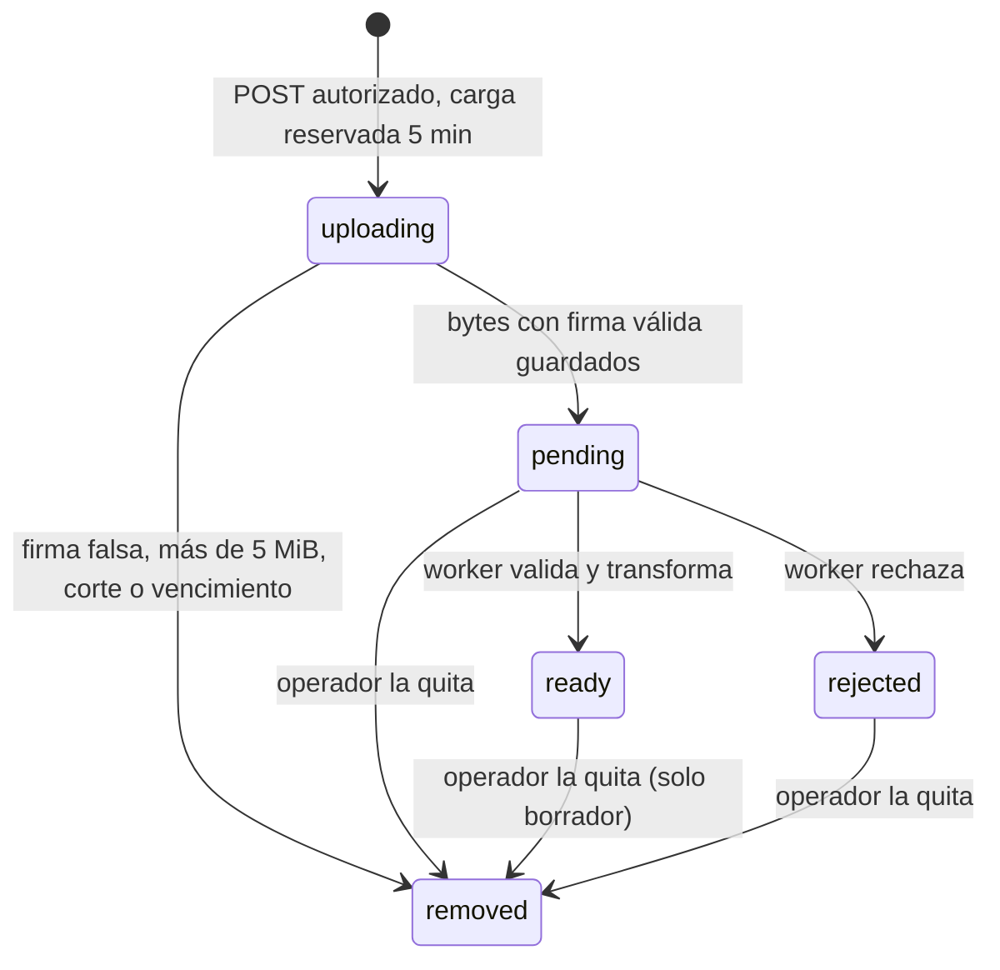

# Fotos de lotes (RF02)

Un operador puede agregar hasta tres fotos a un borrador. La API recibe el archivo,
el worker lo valida y genera una imagen y una miniatura sin metadatos, y solo las
fotos listas se publican y se muestran. Las fotos son opcionales: un lote sin fotos
se publica igual. El contrato HTTP está en [OpenAPI](api/openapi.yaml) (etiqueta
`Photos`) y las decisiones con alternativas, en [ADR 0005](adr/0005-ciclo-de-fotos.md).

## Ciclo de una foto

1. **Autorización antes de los bytes.** `POST /lots/{lotId}/photos` exige sesión,
   Origin y CSRF. Bajo el bloqueo del lote, Application comprueba membership, que
   sea borrador, que haya posición libre (máximo 3) y que el operador no tenga ya dos
   cargas vigentes en cualquier lote. Reserva la carga por 5 minutos y confirma; solo
   después HTTP lee el cuerpo.
2. **Recepción.** El cuerpo es el archivo binario (`image/jpeg`, `image/png` o
   `image/webp`), hasta 5 MiB, en una ruta separada del límite JSON de 16 KiB. El MIME
   declarado no basta: Domain exige la firma de JPEG, PNG o WebP en los bytes. El
   original se guarda como objeto temporal y la foto queda `pending` (202).
3. **Validación en el worker.** Toma una foto por vez. Decodifica con
   [sharp](https://sharp.pixelplumbing.com/) y rechaza formatos distintos a los tres
   permitidos (SVG incluido), animaciones (WebP animado y APNG), más de 20 megapíxeles
   y archivos que no se pueden decodificar. Aplica la orientación EXIF y genera WebP
   de hasta 1600 px y 500 KiB, y una miniatura de hasta 400 px y 100 KiB, sin EXIF,
   XMP ni ICC. Si no consigue una salida dentro de esos límites, rechaza.
4. **Resultado.** La foto queda `ready` o `rejected` con su motivo. El original
   temporal se borra en ese momento.
5. **Publicación (D-05).** Publicar exige que todas las fotos activas estén `ready`.
   Una foto en carga, en validación o rechazada responde 422 hasta que termine o el
   operador la quite. Se comprueba bajo el mismo bloqueo del lote, sin llamadas
   externas. Publicado, las fotos quedan fijas: cargar o quitar responde 409.

| Límite | Valor |
| --- | --- |
| Fotos por lote | 3, en posiciones 1–3 |
| Archivo de entrada | JPEG, PNG o WebP estáticos; 5 MiB; 20 MP decodificados |
| Imagen de presentación | WebP, lado mayor ≤ 1600 px, ≤ 500 KiB |
| Miniatura | WebP, lado mayor ≤ 400 px, ≤ 100 KiB |
| Carga reservada | 5 minutos |
| Cargas simultáneas | 2 por operador (429 con `Retry-After`) |
| Validación | Un archivo por worker; reclamo de 2 minutos; 3 intentos |

Los límites vienen de E1 (anexos I p. 25). KB y MB se interpretan como KiB y MiB, igual
que el límite JSON de 16 KiB.

## Lectura

Las imágenes se sirven desde la API en `GET /lots/{lotId}/photos/{photoId}/{display|thumbnail}`:

- **Lote publicado:** cualquiera, sin sesión, con `Cache-Control: private, max-age=3600`.
- **Borrador:** solo operadores del establecimiento, con `no-store`. Para otros responde
  404, sin confirmar que el borrador exista.

`PublicLot.photoUrl` es la ruta de la primera foto lista (miniatura en la búsqueda, imagen
de presentación en el detalle) y `PublicLot.photos` lista todas las fotos listas en orden
de posición, con sus dos variantes y dimensiones. Las rutas son relativas a la base de la
API; la web las completa con su base `/api`. El detalle público muestra la galería; si
una imagen falta o falla, la web muestra el reemplazo local. El operador consulta
estado, motivo de rechazo y rutas en `GET /lots/{lotId}/photos` y quita una foto con
`DELETE /lots/{lotId}/photos/{photoId}`.

## Formulario del operador

En `/operador/lotes/:lotId` el borrador muestra sus fotos por posición, con estado
(«Cargando», «En validación», «Lista», «Rechazada» con el motivo) y botón para quitarlas.
Un lote nuevo pide guardar el borrador antes, porque la carga exige un lote existente.

- **Carga:** un archivo por vez. La web avisa antes de enviar si el tipo no es JPEG, PNG
  o WebP o si supera 5 MiB; la decisión es de la API. El archivo viaja como cuerpo
  binario con su Content-Type. «Agregar foto» se oculta con tres fotos activas.
- **Validación:** mientras haya fotos en carga o validación, la web consulta
  `GET /lots/{lotId}/photos` cada 3 s (20 por minuto, dentro del límite por usuario) y
  deja de hacerlo al terminar o al salir de la página.
- **Errores:** 413, 415 y 422 explican el archivo; 409 actualiza la lista (lote
  publicado, tres fotos o carga vencida); 429 indica cuántos segundos esperar según
  `Retry-After`; 503 explica que la carga no está disponible y que se puede publicar
  sin fotos. Una respuesta perdida no se reintenta: se consulta la lista.
- **Publicar (D-05):** el botón se deshabilita mientras haya fotos no listas. Si la API
  igual responde 422 (por ejemplo, otra pestaña cargó una foto), se muestra su mensaje y
  se actualiza la lista.
- **Publicado:** las fotos listas se muestran en solo lectura, sin cargar ni quitar.

Las miniaturas usan el mismo componente que la búsqueda: si una imagen falla, se muestra
el reemplazo local y el resto del lote sigue visible.

## Persistencia y limpieza

`lot_photos` guarda lote, autor, posición, estado, plazo de la carga, tamaño y formato
del original, dimensiones de la imagen, motivo de rechazo, intentos y marcas de
borrado de objetos. Las claves de objeto se derivan del ID aleatorio de la foto
(`uploads/{id}`, `photos/{id}/display.webp`, `photos/{id}/thumbnail.webp`), nunca de un
nombre aportado por el usuario. Cada clave existe en la base antes de escribir su
objeto, así que no quedan objetos sin registro.

El worker revisa cada minuto:

| Caso | Acción |
| --- | --- |
| Carga reservada vencida hace más de 1 minuto | Pasa a `removed` y borra el temporal |
| Foto quitada | Borra temporal, imagen y miniatura |
| Foto procesada con temporal pendiente de borrar | Borra el temporal |

Así los originales y las cargas abandonadas desaparecen en minutos, dentro del plazo de
24 h de E1. Una carga que termina después de vencer no se confirma (409) y borra su
objeto. Si el operador quita una foto durante su validación, el worker borra lo que
alcanzó a escribir.

**Reinicio.** Reclamar una foto confirma de inmediato el reclamo de 2 minutos; la
validación ocurre sin transacciones abiertas. Si el worker se detiene, otro proceso
la retoma al vencer el reclamo y sobrescribe las mismas claves: no se duplican fotos
ni registros. Tras tres intentos interrumpidos, la foto queda `rejected` con
`processing_failed`. SIGTERM termina la foto en curso antes de salir.

## Datos personales y EXIF

Una foto de celular puede traer en su EXIF la ubicación GPS, la fecha, el modelo del
teléfono y el nombre del autor. Son datos personales, así que se tratan según la
Ley 21.719, que entra en vigencia en diciembre de 2026 (hasta entonces rige la
Ley 19.628):

| Principio | Cómo se cumple |
| --- | --- |
| Proporcionalidad | La imagen y la miniatura se vuelven a codificar sin EXIF, XMP ni ICC: GPS, fecha, dispositivo y autor no llegan a nadie. Lo prueban `photos-domain.test.ts`, con un fixture que trae GPS y autor, y `db:test:photos` sobre la imagen que sirve la API. |
| Finalidad | Del EXIF solo se usa la orientación, para girar la imagen. El resto no se lee ni se guarda en la base. |
| Temporalidad | El original con EXIF es un objeto temporal que se borra apenas termina la validación, y la limpieza lo revisa cada minuto. Si el worker está detenido, el original espera en el bucket privado hasta que vuelva; no se sirve ni entra al respaldo. K051 (#54) prueba esa retención. |
| Seguridad | El bucket es privado y la API solo entrega imagen y miniatura, nunca el original. Las claves de objeto usan el ID aleatorio de la foto, no el nombre del archivo, y los registros guardan códigos, no metadatos. |

## Configuración

| Variable | API | Worker | Uso |
| --- | --- | --- | --- |
| `PHOTO_STORAGE` | ✓ | ✓ | `s3` (bucket privado) o `local` (solo desarrollo). Vacía: cargar responde 503 y el worker queda inactivo. |
| `PHOTO_LOCAL_DIR` | ✓ | ✓ | Directorio compartido con `local`; Compose usa el volumen `photo_data`. |
| `PHOTO_S3_ENDPOINT`, `PHOTO_S3_REGION`, `PHOTO_S3_BUCKET` | ✓ | ✓ | Bucket S3 compatible. Endpoint HTTPS sin credenciales. |
| `PHOTO_S3_ACCESS_KEY_ID`, `PHOTO_S3_SECRET_ACCESS_KEY` | ✓ | ✓ | Application key limitada al bucket. |
| `DATABASE_URL` | ✓ | ✓ | El worker usa un Pool de 2 conexiones. |

`PHOTO_STORAGE=local` se rechaza con `NODE_ENV=production`: las fotos no van en el
disco efímero de un servicio. Las claves nunca llevan prefijo `VITE_`. Los objetos
viven bajo el prefijo `lot-photos/` del bucket. B2 versiona los objetos: borrar
elimina todas las versiones de la clave, no solo agrega un marcador.

## Proveedor de objetos

Se usa **Backblaze B2 privado mediante AWS SDK v3** (S3). Se comparó con Supabase
Storage, Cloudflare R2 y disco local por gratuidad, privacidad, borrado,
portabilidad e integración con Node:

| Alternativa | Motivo |
| --- | --- |
| **Backblaze B2** | Elegido: 10 GB gratuitos, registro sin tarjeta, bucket privado y protocolo S3. |
| Supabase Storage | 1 GB gratuito, proyecto que se pausa tras una semana sin uso y claves S3 con acceso a todos los buckets. |
| Cloudflare R2 | Exige alta con medio de pago y no implementa todas las operaciones S3 usadas. |
| Disco local | Depende del host y su volumen, sin réplica ni respaldo. Solo para desarrollo. |

El escenario de E1 (10 000 lotes × 3 fotos × 600 KB ≈ 18 GB, anexos I p. 26) es un
supuesto de dimensionamiento, no consumo medido: excede los 10 GB gratuitos. Ajustar
retención o recursos se decide con el equipo antes del piloto completo.

### Bucket B2

1. Crear una cuenta B2 Cloud Storage sin medio de pago y fijar límites de gasto en
   cero en [Caps & Alerts](https://www.backblaze.com/docs/en/cloud-storage-data-caps-and-alerts).
   No activar Event Notifications.
2. Crear un bucket **Private**, sin Object Lock, enlaces públicos ni CDN.
3. Crear una [application key](https://www.backblaze.com/docs/cloud-storage-create-and-manage-app-keys)
   **Read and Write** solo para ese bucket, con permiso para listar versiones.
4. Configurar las cinco variables `PHOTO_S3_*` en `api/.env` local o en Railway.
   No pegarlas en el chat, PR ni capturas.

`npm --prefix api run photos -- s3 smoke` comprueba ese bucket con un fixture de 75
bytes: ACL solo del propietario, carga, lectura desde un cliente nuevo, rechazo de
lectura anónima o con firma alterada y borrado de todas las versiones. La CLI usa
solo el fixture de [api/fixtures](../api/fixtures/README.md); su registro está en
[evidencia K005](evidencia/k005.md). `npm --prefix api run test:photos` prueba el
adaptador local del prototipo.

## Respaldo

`pg_dump` no guarda bytes de fotos. E1 (anexos I p. 28) pide copias separadas de las
imágenes finales con un manifiesto de referencias y ensayar la restauración; ese
procedimiento corresponde a K053 (#56). Los originales temporales no forman parte del
respaldo.

## Pruebas

| Comando | Qué comprueba |
| --- | --- |
| `npm --prefix api test` | Firmas, APNG, SVG, animaciones, 20 MP, truncados, EXIF eliminado, orientación y límites de salida con sharp real; transporte HTTP (401, 403, 413 declarado y por streaming, 415, 422, 429) contra OpenAPI; D-05 en Domain. |
| `npm --prefix api run test:web:compose` | Formulario del operador en Chromium con la API y un worker reales: tipo no permitido sin enviar, archivo falso (422), imagen animada rechazada por el worker, JPEG listo con miniatura, quitar, 422 por foto no lista desde otra pestaña, publicación con fotos, galería con ambas fotos y reemplazo en el detalle público. |
| `npm --prefix api run db:test:photos:compose` | PostgreSQL real y objetos en disco: acceso ajeno, archivos falsos y grandes, límites de 3 fotos y 2 cargas, publicación bloqueada hasta quitar la rechazada, reinicio con reclamo vencido sin duplicar, tres intentos, carga vencida limpiada, foto quitada durante la validación, recorrido HTTP con sesión/CSRF y proceso real del worker con un archivo de 20 MP y 4,3 MiB (memoria máxima medida y SIGTERM). Termina con un inventario: solo quedan salidas de fotos listas. |

Ambos corren en CI.
