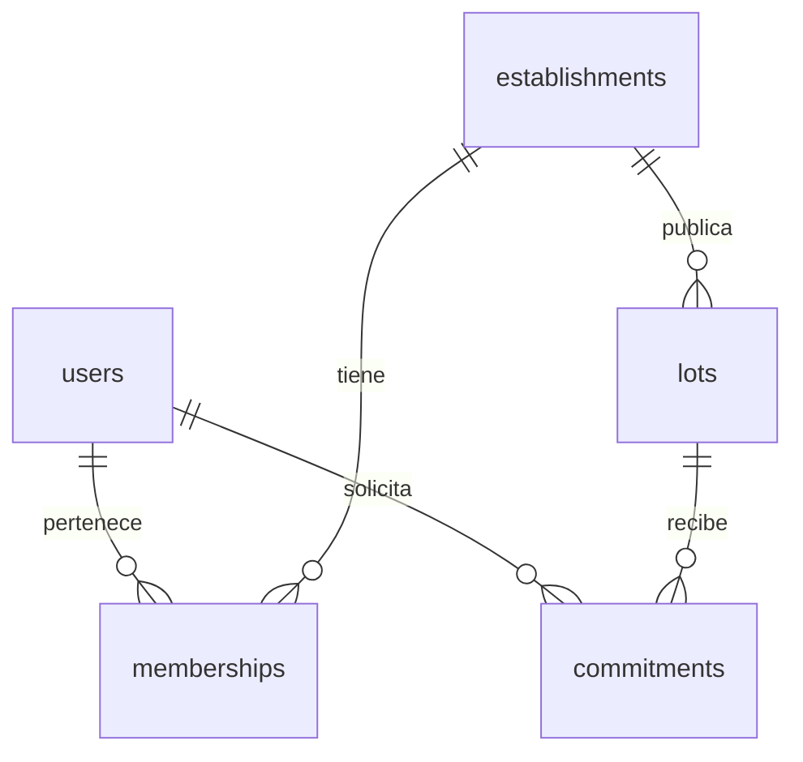

# K003 — Modelo inicial de Rescate

Derivado antes de escribir la migración, sobre `development` `00597b8`.
Alcance: persistencia de RF01, RF02 y RF04; no implementación de sus operaciones.

**Aclaración de dominio posterior a E1 (2026-09-20):**
[ADR 0002](adr/0002-ofertas-parciales.md) permite ofertas parciales a la cabeza
FIFO y cierra la solicitud al aceptar, rechazar o vencer sin respuesta, sin
prioridad residual ni reingreso automático. Volver a solicitar exige una nueva
solicitud explícita y una nueva posición FIFO. Las precisiones
de cantidades de abajo corresponden a esa decisión posterior; no cambian el
esquema, migración, pruebas ni alcance de K003. La representación de solicitudes
posteriores sobre el mismo lote y su compatibilidad con una reserva confirmada
activa permanecen registradas allí como riesgo futuro del modelo.

## Fuentes y clasificación

- **A: requisito E1/anexos.** [Informe E1](entregas/e1/informe-e1.pdf),
  pp. 1–3 y 5: actores, packs indivisibles, publicación, compromiso y etapas.
- **A:** [Anexos E1](entregas/e1/anexos-e1.pdf), A p. 1 (RF01/02/04),
  B p. 4 (relaciones, bigint, cantidades, estados y timestamptz), C p. 5
  (borradores y concurrencia), F p. 8 (compromiso), G pp. 12–17
  (correcciones a maquetas), H pp. 18, 20–21 (supuestos, ubicación, correo),
  I pp. 24–27 (historial de migraciones y alcance posterior).
- **B: decisión técnica de implementación**, necesaria para materializar este
  subconjunto. No se atribuye a E1.
- **C: aspecto abierto**, que no se convierte en regla permanente. Los requisitos
  conocidos pero fuera de K003 se distinguen de lo todavía no definido.

Se revisaron ambos PDF completos y el resto de `docs/`, ADR 0001, scripts,
lockfile, SQL histórico, Compose, CI, API y tipos propuestos de K004. La extracción
inicial con pypdf omitía fragmentos; se releyeron los PDF con PyMuPDF, que recuperó
RF02 y los estados de B (algunas ligaduras se muestran defectuosamente).

## Entidades y atributos

Todos los `id` son `bigint GENERATED ALWAYS AS IDENTITY PRIMARY KEY`: bigint
es **A** (B p. 4); generación identity es **B**. Todas las FK son NOT NULL,
con NO ACTION para borrado/actualización (**B**: impedir huérfanos sin borrar
historia en cascada). Los campos siguientes son NOT NULL salvo `conditions` y
`published_at`. No hay datos semilla de negocio.

| Entidad y propósito | Atributos | PK | FK |
| --- | --- | --- | --- |
| `users`: cuenta de una persona, que puede rescatar y operar establecimientos (A: RF01) | `id`, `email` text, `created_at` timestamptz | `id` | — |
| `establishments`: negocio u organización que publica (A: informe p. 1) | `id`, `name` text, `address` text, `latitude`/`longitude` double precision, `time_zone` text | `id` | — |
| `memberships`: pertenencia de un operador a un establecimiento (A: RF01/B) | `id`, `user_id`, `establishment_id` | `id` | `user_id → users.id`, `establishment_id → establishments.id` |
| `lots`: packs equivalentes ofrecidos por un establecimiento (A: RF02/B/F) | `id`, `establishment_id`, `description` text, `category` text, `quantity` integer, `conditions` text nullable, `address` text, `latitude`/`longitude` double precision, `time_zone` text, `pickup_starts_at`/`pickup_ends_at` timestamptz, `status` text, `created_at` timestamptz, `published_at` timestamptz nullable | `id` | `establishment_id → establishments.id` |
| `commitments`: compromiso de un usuario sobre una cantidad de un lote; K003 representa únicamente la variante confirmada (A: RF04/B/F). Tras una oferta parcial, la cantidad confirmada es la aceptada (decisión posterior: ADR 0002). | `id`, `user_id`, `lot_id`, `quantity` integer, `status` text, `created_at` timestamptz | `id` | `user_id → users.id`, `lot_id → lots.id` |

### Justificación y nullability

- Correo como identificador: **A**, H p. 21. UNIQUE exacto y texto no vacío:
  **B**, sin fijar todavía normalización de mayúsculas ni validación de formato
  (**C**, K008). No hay nombre visible, contraseña, estado de cuenta ni sesión.
  K008 añadirá almacenamiento de credenciales según H, sin contraseñas ficticias.
- Nombre del establecimiento: **B**, etiqueta mínima para distinguirlo; no razón
  social, RUT, teléfono ni datos empresariales. Dirección/coordenadas: **A**, H
  p. 20; zona horaria: **A**, B p. 4. Representación en dos coordenadas y texto
  de zona: **B**. Se conservan coordenadas WGS84 para la búsqueda PostGIS futura;
  K003 no agrega extensiones ni índices de búsqueda prematuros. La validez del
  identificador IANA se validará en aplicación; SQL solo exige texto no vacío.
- Membresía: N:M (**A**, RF01/B); UNIQUE del par (**B**, una pertenencia sin
  duplicados). La misma persona puede pertenecer a varios establecimientos y
  cada uno tener varios operadores. No hay catálogo genérico de roles. El registro
  representa pertenencia; no implementa autorización ni habilitación administrativa.
  Granularidad de permisos, revocación y representación del administrador: **C**.
- Descripción del pack, categoría, cantidad, dirección, ubicación, ventana y
  condiciones: **A**, RF02. La descripción representa el contenido; no se inventa
  otro título. Catálogo de categorías: **C**; por ahora texto no vacío (**B**).
  Condiciones nullable (**B**): NULL indica que no se han indicado condiciones,
  sin inventar un texto o una regla sanitaria. Su obligatoriedad se revisa en K010.
- Ubicación y zona se guardan también en lote (**B**, instantánea), porque RF02
  exige conservar lugar/plazo publicados aunque cambie el establecimiento.
- K003 exige una declaración completa incluso en borrador (**B**, contrato de
  persistencia inicial); E1 no precisa guardado parcial (**C**). K010 debe decidir
  explícitamente si permite campos pendientes y, de ser necesario, agregar una
  migración. No se afirma que E1 prohíba borradores incompletos.
- `created_at DEFAULT CURRENT_TIMESTAMP` en cuenta, lote y compromiso (**B**):
  conserva el instante de creación sin auditoría completa. `published_at` nullable
  permite distinguir borrador de publicación (**A** concepto RF02; **B** columna).
  Ventana de retiro **A**, cierre posterior al inicio **B**, validación estructural.
  No se comparan fechas con el reloj en CHECK. No hay `updated_at`, triggers de
  auditoría, versión optimista ni timestamps de acciones aún inexistentes.

## Relaciones, unicidad y estados

Estados almacenados, traducción técnica **B** de términos explícitos de B p. 4:

| Tabla | Estados iniciales | Default | Justificación |
| --- | --- | --- | --- |
| `lots` | `draft`, `published` | `draft` | Representar borrador/publicado de RF02 sin ejecutar publicación |
| `commitments` | `confirmed` | Ninguno | Representar reserva confirmada de RF04, exigiendo intención explícita al insertar |

Se usan `text` + CHECK con nombre (**B**), no ENUM: una migración posterior puede
sustituir el catálogo y ajustar índices con SQL ordinario. No son las máquinas de
estados completas. `closed`/`expired` de lotes y espera/ofertado/cancelado/vencido/
retirado de compromisos están definidos en E1, pero deliberadamente pospuestos.
Agotado es condición del inventario, no estado (B p. 4).

`lots_publication_check` exige `published_at IS NULL` en borrador y NOT NULL en
publicado (**B**, coherencia local de campos). No publica, valida permisos,
congela contenido ni verifica fotos. El índice UNIQUE parcial
`commitments_active_user_lot_key` protege `(user_id, lot_id)` cuando
`status = 'confirmed'` (**A**, RF04, implementación **B**). Al incorporar espera y
ofertas, la misma migración deberá ampliar el predicado a esos estados activos;
no sustituirlo por UNIQUE permanente que impida nuevos compromisos históricos.
ADR 0002 no elimina esta restricción: cerrar la solicitud en cola al aceptar
parcialmente no termina la reserva confirmada. Antes de admitir una nueva
solicitud simultánea del mismo usuario/lote debe resolverse esa compatibilidad;
no se presupone reingreso inmediato ni se cambia el índice de K003.

## Cantidades y demás restricciones

- `lots.quantity` representa Q, cantidad declarada/publicada, entera y > 0.
- `commitments.quantity`, en la única variante `confirmed` de K003, representa
  packs comprometidos, entera y > 0. Aclaración posterior a E1 (ADR 0002): si se
  solicitaron 10 y se ofrecieron/aceptaron 4, la reserva corresponde a 4. K003 no
  representa por separado solicitud original, oferta ni cierre de la posición;
  su trazabilidad corresponde al diseño futuro, sin migración en esta revisión.
- Ambas son NOT NULL con CHECK nombrados. Cero, negativos y NULL se rechazan.
  El tipo integer rechaza parámetros de texto fraccionarios y fuera de rango;
  la API futura deberá rechazar fracciones antes de cualquier cast SQL que redondee.
- No hay cantidades en las otras tres entidades. No hay límite de dos packs
  (RF04 y corrección G p. 12), ni límite SQL de 100: H p. 18 lo presenta como
  supuesto de dimensionamiento, al igual que la ventana de 24 h.
- **Requisito conocido pospuesto:** B p. 4 exige Q = F + O + R + E + X y contadores
  no negativos (cero sí es válido para esos contadores). K003 conserva Q, pero
  no crea inventario parcial ni cinco contadores que aún no tienen operaciones.
  Incorporarlos, conciliarlos con compromisos y validar cantidad contra Q y
  disponibilidad bajo bloqueo corresponde a la reserva transaccional posterior.
  Los CHECK actuales no garantizan ausencia de sobreasignación entre filas.
  ADR 0002 precisa que F → O y O → R mueven solo la cantidad ofrecida y aceptada;
  Q no cambia y la demanda restante no constituye inventario ni prioridad residual.
- UNIQUE: correo exacto, par de membresía y compromiso activo usuario/lote.
- CHECK: cantidades, estados, ventana ordenada, coherencia de publicación,
  latitud [-90,90], longitud [-180,180], textos requeridos no vacíos y descripción
  de hasta 2000 caracteres (H p. 20). Los rangos excluyen NaN e infinitos.
- Las cinco PK y cinco FK son restricciones reales. No hay cascadas, triggers,
  límites por usuario arbitrarios ni índices sin una consulta/restricción actual.

## Ambigüedades y compatibilidad

E1 no especifica normalización del correo, catálogo de categorías, roles de
membresía detallados, obligatoriedad de condiciones ni guardado parcial del
borrador: quedan **C**. El máximo de 100 packs/24 h de H es escenario de escala,
no se transforma silenciosamente en regla comercial. Las maquetas muestran
máximo dos packs y edición de cantidades: G pp. 12/15 los corrige expresamente;
se sigue el texto normativo. No se detectó otra contradicción que impida K003.

K004 propone `displayName`, `title`, `quantity?: string`, `expiresAt` y estados
libres. No son columnas obligatorias del dominio: nombre visible/título quedan
pendientes; cantidad persistida es integer; la ventana tiene inicio/fin y no se
confunde con caducidad del alimento (I p. 26). El transporte y mapeo se acordarán
al implementar endpoints. E1 B ya fija identificadores públicos opacos: K003 solo
crea claves internas; antes de exponer recursos se agregarán los identificadores
públicos, sin usar bigint como credencial ni convertirlo a Number sin control.

## Migraciones e integración

Se conserva intacta `1789915246470_migration-tool-test.sql`, como exige ADR 0001.
La migración nueva crea users/establishments, memberships/lots y commitments;
down elimina solo esas cinco tablas, en orden inverso y sin CASCADE. La tabla
K002 y su historial previo permanecen. Down elimina datos K003: solo se prueba
en una base dedicada, nunca sobre la base de desarrollo.

Se mantiene node-pg-migrate 9.0.0, pg 8.23.0, SQL Up/Down, public.pgmigrations,
transacciones, advisory lock y comandos npm de K002. No hay segundo gestor.
La prueba existente se adapta a todo el historial y nunca revierte K002.
La infraestructura se reutiliza sin cambiar Compose ni abrir otro PostgreSQL.

## Fuera de K003

K008: registro/login/logout, credenciales, sesiones, CSRF, permisos y habilitación.
K010: edición, versión optimista, publicación e inmutabilidad. K009/K011: contratos,
formularios y web. K012: recorrido integrado. S03 y posteriores: asignación
transaccional, contadores, idempotencia, cancelación, códigos, retiro, FIFO,
ofertas, vencimientos, chat, avisos, incidencias, auditoría y retención.
K005 y tarjetas de fotos: objetos privados, referencias, metadatos, procesamiento,
miniaturas y EXIF. Ninguna de esas capacidades se declara implementada por K003.

La [evidencia y reproducción](k003-evidencia.md) registra ejecuciones reales,
limitaciones y propuesta de PR. La revisión de otro integrante y la integración
siguen siendo necesarias para cerrar formalmente la tarjeta según E1 p. 5.
