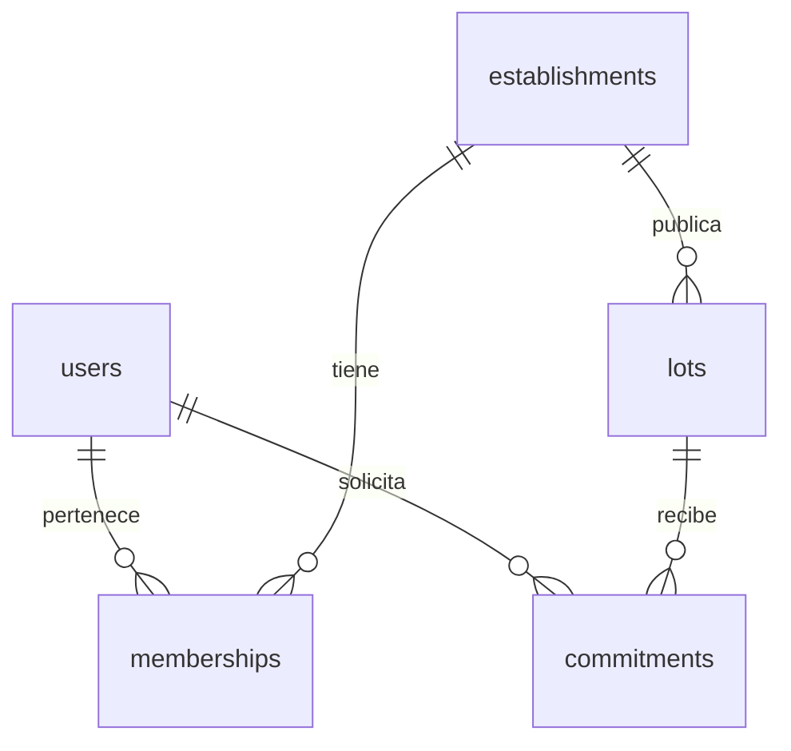
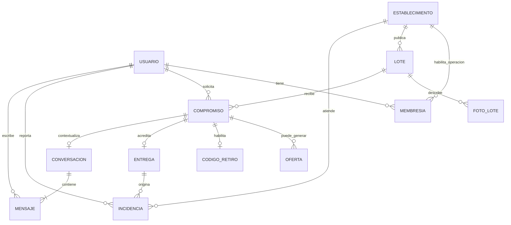
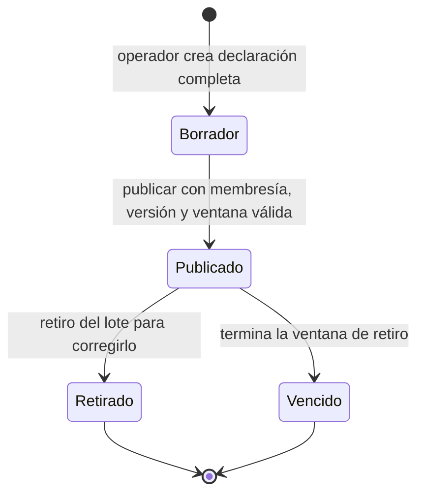
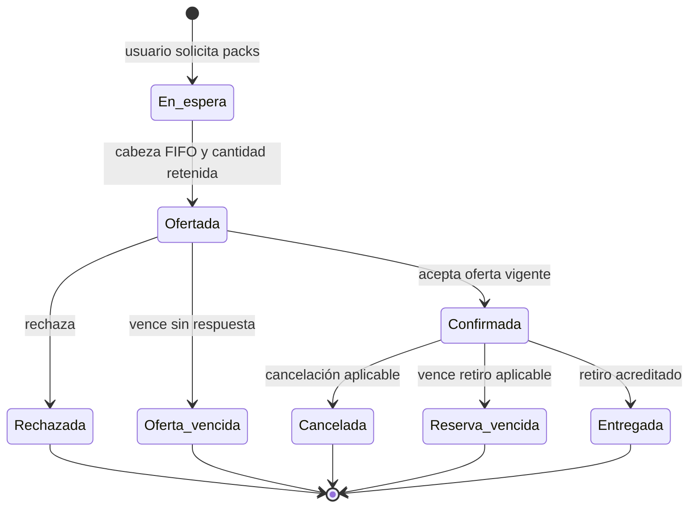

# K003 — Modelo inicial de Rescate

Derivado antes de escribir la migración, sobre `development` `00597b8`.
Alcance: persistencia de RF01, RF02 y RF04; no implementación de sus operaciones.

**Contrato S02 posterior (2026-09-21):** [OpenAPI](api/README.md) concreta transporte
sin cambiar este SQL: borradores completos, condiciones particulares opcionales/null,
correo con trim exterior y comparación sin distinguir mayúsculas (preservando puntos
y sufijos +), versión optimista y publicación explícita. Las ambigüedades históricas
de abajo conservan el contexto K003; estas decisiones ya no están abiertas. K008/K010
deberán añadir los cambios de persistencia necesarios mediante nuevas migraciones,
incluida unicidad del correo normalizado, versión e identificadores públicos opacos.

**Aclaración de dominio posterior a E1 (2026-09-20):**
[ADR 0002](adr/0002-ofertas-parciales.md) permite ofertas parciales a la cabeza
FIFO y cierra la solicitud al aceptar, rechazar o vencer sin respuesta, sin
prioridad residual ni reingreso automático. Volver a solicitar exige una nueva
solicitud explícita y una nueva posición FIFO. Las precisiones
de cantidades de abajo corresponden a esa decisión posterior; no cambian el
esquema, migración, pruebas ni alcance de K003. La representación de solicitudes
posteriores sobre el mismo lote y su compatibilidad con una reserva confirmada
activa permanecen registradas allí como riesgo futuro del modelo.

**Estado posterior K010:** este documento conserva el modelo inicial K003.
Las migraciones aditivas K010 incorporan `lots.public_id`, `version`, `updated_at`
y `establishments.public_id`. El [documento K010](k010-publicacion-lotes.md)
describe publicación, inmutabilidad, autorización y PATCH parcial implementados;
K008 sigue pendiente. No se reinterpretan las restricciones históricas de K003.

**Modelo conceptual E2 (K013, 2026-09-21):** las secciones
[Modelo conceptual E2](#modelo-conceptual-e2-k013) y posteriores describen el
dominio que deben cubrir los siguientes casos de uso. No son una ampliación del
SQL K003/K010 ni prueban una funcionalidad integrada: fotos, solicitudes, ofertas,
códigos, entregas, conversaciones e incidencias siguen fuera de la persistencia y
de las rutas actuales. Conservan las reglas E1 que no fueron modificadas y aplican
la excepción de oferta parcial de [ADR 0002](adr/0002-ofertas-parciales.md).

## Fuentes y clasificación

- **A: requisito E1/anexos.** [Informe E1](entregas/e1/informe-e1.pdf),
  pp. 1–3 y 5: actores, packs indivisibles, publicación, compromiso y etapas.
- **A:** [Anexos E1](entregas/e1/anexos-e1.pdf), A p. 1 (RF01/02/04),
  B p. 4 (relaciones, bigint, cantidades, estados y timestamptz), C p. 5
  (borradores y concurrencia), F p. 8 (compromiso), G pp. 12–17
  (correcciones a maquetas), H pp. 18, 20–21 (supuestos, ubicación, correo),
  I pp. 24–27 (historial de migraciones y alcance posterior).
- **B: decisión técnica de implementación**, necesaria para materializar este
  subconjunto. No se atribuye a E1.
- **C: aspecto abierto**, que no se convierte en regla permanente. Los requisitos
  conocidos pero fuera de K003 se distinguen de lo todavía no definido.

Se revisaron ambos PDF completos y el resto de `docs/`, ADR 0001, scripts,
lockfile, SQL histórico, Compose, CI, API y tipos propuestos de K004. La extracción
inicial con pypdf omitía fragmentos; se releyeron los PDF con PyMuPDF, que recuperó
RF02 y los estados de B (algunas ligaduras se muestran defectuosamente).

## Entidades y atributos

Todos los `id` son `bigint GENERATED ALWAYS AS IDENTITY PRIMARY KEY`: bigint
es **A** (B p. 4); generación identity es **B**. Todas las FK son NOT NULL,
con NO ACTION para borrado/actualización (**B**: impedir huérfanos sin borrar
historia en cascada). Los campos siguientes son NOT NULL salvo `conditions` y
`published_at`. No hay datos semilla de negocio.

| Entidad y propósito | Atributos | PK | FK |
| --- | --- | --- | --- |
| `users`: cuenta de una persona, que puede rescatar y operar establecimientos (A: RF01) | `id`, `email` text, `created_at` timestamptz | `id` | — |
| `establishments`: negocio u organización que publica (A: informe p. 1) | `id`, `name` text, `address` text, `latitude`/`longitude` double precision, `time_zone` text | `id` | — |
| `memberships`: pertenencia de un operador a un establecimiento (A: RF01/B) | `id`, `user_id`, `establishment_id` | `id` | `user_id → users.id`, `establishment_id → establishments.id` |
| `lots`: packs equivalentes ofrecidos por un establecimiento (A: RF02/B/F) | `id`, `establishment_id`, `description` text, `category` text, `quantity` integer, `conditions` text nullable, `address` text, `latitude`/`longitude` double precision, `time_zone` text, `pickup_starts_at`/`pickup_ends_at` timestamptz, `status` text, `created_at` timestamptz, `published_at` timestamptz nullable | `id` | `establishment_id → establishments.id` |
| `commitments`: compromiso de un usuario sobre una cantidad de un lote; K003 representa únicamente la variante confirmada (A: RF04/B/F). Tras una oferta parcial, la cantidad confirmada es la aceptada (decisión posterior: ADR 0002). | `id`, `user_id`, `lot_id`, `quantity` integer, `status` text, `created_at` timestamptz | `id` | `user_id → users.id`, `lot_id → lots.id` |

### Justificación y nullability

- Correo como identificador: **A**, H p. 21. UNIQUE exacto y texto no vacío:
  **B**, sin fijar todavía normalización de mayúsculas ni validación de formato
  (**C**, K008). No hay nombre visible, contraseña, estado de cuenta ni sesión.
  K008 añadirá almacenamiento de credenciales según H, sin contraseñas ficticias.
- Nombre del establecimiento: **B**, etiqueta mínima para distinguirlo; no razón
  social, RUT, teléfono ni datos empresariales. Dirección/coordenadas: **A**, H
  p. 20; zona horaria: **A**, B p. 4. Representación en dos coordenadas y texto
  de zona: **B**. Se conservan coordenadas WGS84 para la búsqueda PostGIS futura;
  K003 no agrega extensiones ni índices de búsqueda prematuros. La validez del
  identificador IANA se validará en aplicación; SQL solo exige texto no vacío.
- Membresía: N:M (**A**, RF01/B); UNIQUE del par (**B**, una pertenencia sin
  duplicados). La misma persona puede pertenecer a varios establecimientos y
  cada uno tener varios operadores. No hay catálogo genérico de roles. El registro
  representa pertenencia; no implementa autorización ni habilitación administrativa.
  Granularidad de permisos, revocación y representación del administrador: **C**.
- Descripción del pack, categoría, cantidad, dirección, ubicación, ventana y
  condiciones: **A**, RF02. La descripción representa el contenido; no se inventa
  otro título. Catálogo de categorías: **C**; por ahora texto no vacío (**B**).
  Condiciones nullable (**B**): NULL indica que no se han indicado condiciones,
  sin inventar un texto o una regla sanitaria. Su obligatoriedad se revisa en K010.
- Ubicación y zona se guardan también en lote (**B**, instantánea), porque RF02
  exige conservar lugar/plazo publicados aunque cambie el establecimiento.
- K003 exige una declaración completa incluso en borrador (**B**, contrato de
  persistencia inicial); E1 no precisa guardado parcial (**C**). K010 debe decidir
  explícitamente si permite campos pendientes y, de ser necesario, agregar una
  migración. No se afirma que E1 prohíba borradores incompletos.
- `created_at DEFAULT CURRENT_TIMESTAMP` en cuenta, lote y compromiso (**B**):
  conserva el instante de creación sin auditoría completa. `published_at` nullable
  permite distinguir borrador de publicación (**A** concepto RF02; **B** columna).
  Ventana de retiro **A**, cierre posterior al inicio **B**, validación estructural.
  No se comparan fechas con el reloj en CHECK. No hay `updated_at`, triggers de
  auditoría, versión optimista ni timestamps de acciones aún inexistentes.

## Relaciones, unicidad y estados

Estados almacenados, traducción técnica **B** de términos explícitos de B p. 4:

| Tabla | Estados iniciales | Default | Justificación |
| --- | --- | --- | --- |
| `lots` | `draft`, `published` | `draft` | Representar borrador/publicado de RF02 sin ejecutar publicación |
| `commitments` | `confirmed` | Ninguno | Representar reserva confirmada de RF04, exigiendo intención explícita al insertar |

Se usan `text` + CHECK con nombre (**B**), no ENUM: una migración posterior puede
sustituir el catálogo y ajustar índices con SQL ordinario. No son las máquinas de
estados completas. `closed`/`expired` de lotes y espera/ofertado/cancelado/vencido/
retirado de compromisos están definidos en E1, pero deliberadamente pospuestos.
Agotado es condición del inventario, no estado (B p. 4).

`lots_publication_check` exige `published_at IS NULL` en borrador y NOT NULL en
publicado (**B**, coherencia local de campos). No publica, valida permisos,
congela contenido ni verifica fotos. El índice UNIQUE parcial
`commitments_active_user_lot_key` protege `(user_id, lot_id)` cuando
`status = 'confirmed'` (**A**, RF04, implementación **B**). Al incorporar espera y
ofertas, la misma migración deberá ampliar el predicado a esos estados activos;
no sustituirlo por UNIQUE permanente que impida nuevos compromisos históricos.
ADR 0002 no elimina esta restricción: cerrar la solicitud en cola al aceptar
parcialmente no termina la reserva confirmada. Antes de admitir una nueva
solicitud simultánea del mismo usuario/lote debe resolverse esa compatibilidad;
no se presupone reingreso inmediato ni se cambia el índice de K003.

## Modelo conceptual E2 (K013)

### Alcance, fuentes y vocabulario

Este modelo reúne los RF que E1 sitúa después de la publicación: reserva,
cancelación, retiro, FIFO, vencimiento, avisos, conversación e incidencias. La
fuente principal son el [informe E1](entregas/e1/informe-e1.pdf), pp. 1–3 y 5, y
los [anexos E1](entregas/e1/anexos-e1.pdf), A pp. 1–2, B p. 4, C p. 5, F p. 8,
H pp. 20–21 e I pp. 24–27. [ADR 0002](adr/0002-ofertas-parciales.md) prevalece
sólo sobre la cantidad que se puede ofrecer y el cierre de la solicitud parcial.
La guía [K005](k005-fotos.md) es evidencia de un prototipo de objetos; no define
la relación de fotos de producto. [OpenAPI S02](api/README.md) es autoridad
únicamente para las operaciones HTTP K008–K011 ya delimitadas.

Los términos se usan así:

- **Usuario** es la persona con cuenta; puede rescatar lotes y, mediante una
  membresía, operar uno o más establecimientos. «Operador» no es otra persona ni
  un rol global: es el usuario cuando actúa para un establecimiento del que es
  miembro. E1 no define la granularidad administrativa ni la revocación de esa
  membresía.
- **Lote** es la oferta publicada por un establecimiento, con su declaración,
  lugar y ventana de retiro. Contiene `Q` **unidades reservables**: packs
  equivalentes e indivisibles; la unidad no es un producto individual ni requiere
  identidad propia. Una cantidad en un compromiso, una oferta o una entrega se
  mide en esos packs. `Q` no equivale a disponibilidad: la conciliación prevista
  por E1 es `Q = F + O + R + E + X`.
- **Compromiso** nombra el ciclo de una persona respecto de un lote. Para no
  perder el significado que exige ADR 0002, el modelo distingue dentro del ciclo
  la **solicitud** (cantidad pedida y posición FIFO), la **oferta** (cantidad
  retenida) y la **reserva confirmada** (cantidad aceptada). K003 sólo persiste la
  última como `commitments.status = confirmed`; por ello no es aún el modelo
  completo de este apartado.
- **Entrega acreditada** es el hecho de que los packs de una reserva fueron
  retirados y pasan a `E`; no es una edición del lote ni una inferencia a partir
  de que se muestre un código. Una incidencia posterior se registra contra esa
  entrega y no deshace por sí misma la acreditación.

### Entidades, responsabilidades y relaciones

| Concepto | Responsabilidad conceptual | Relaciones y cardinalidad | Situación frente a la implementación |
| --- | --- | --- | --- |
| Usuario | Identificar a quien rescata y/o actúa como operador; es autor de solicitudes, mensajes e incidencias. | Un usuario tiene 0..N membresías y 0..N compromisos; cada uno pertenece a un usuario. | `users` existe; credenciales, sesión y habilitación siguen pendientes de K008. |
| Establecimiento | Representar al negocio que publica y acredita retiros. | Tiene 0..N membresías y publica 0..N lotes; una membresía y un lote pertenecen a un establecimiento. | `establishments` existe. |
| Membresía | Vincular un usuario con el establecimiento que puede operar. Es la base del permiso de operador, no un catálogo de roles. | Resuelve la relación N:M entre usuario y establecimiento; una sola por par. | Existe y K010 la comprueba al gestionar el lote. |
| Lote | Declarar una oferta y su ventana; agrupar sus packs equivalentes y el inventario conceptual `F/O/R/E/X`. | Pertenece a un establecimiento; tiene 0..3 fotos; recibe 0..N compromisos. | Existe como borrador/publicado; no guarda fotos ni contadores. |
| Foto de lote | Ser una imagen opcional que ayuda a describir un lote publicado. Sólo una foto lista y autorizada puede hacerse visible; el conjunto queda fijo al publicar. | Cada foto pertenece a exactamente un lote; un lote tiene de 0 a 3 según anexo I p. 25. | K005 sólo prueba objetos privados con un fixture; no existe asociación, carga ni consulta de fotos de lote. |
| Compromiso | Conservar la intención del usuario sobre una cantidad y, si corresponde, su reserva confirmada. Debe distinguir cantidad solicitada, ofrecida y confirmada. | Pertenece a un usuario y un lote; puede originar 0..N ofertas sucesivas sólo si las reglas futuras lo permiten; una reserva confirmada puede tener el código y la entrega que correspondan. | Sólo existe la reserva confirmada, sin solicitud/oferta ni cantidades separadas. |
| Código de retiro | Presentar la credencial de una reserva confirmada para que su titular la consulte y un operador autorizado la revise antes de confirmar el retiro completo. No es un identificador público ni una autorización por sí solo. | Una reserva confirmada tiene un código de ocho caracteres; una solicitud en espera no lo tiene. Se consume al acreditar la única entrega completa. | No existe. Anexos A p. 2 y G pp. 13 y 16 lo definen; no se inventan rotaciones ni códigos alternativos. |
| Entrega | Registrar la acreditación efectiva de una reserva y la cantidad que pasa a `E`. Es un registro asociado, no un atributo booleano: necesita conservar cuándo y en qué compromiso ocurrió. | Pertenece a una reserva confirmada; se propone 0..1 si el retiro es único e íntegro. E1 disponible no define entregas parciales, por lo que no se modelan. | No existe. |
| Incidencia posterior | Registrar un problema comunicado después de una entrega y su atención, sin reescribir la entrega. | Pertenece a una entrega; una entrega puede tener 0..N incidencias mientras no se acuerde una restricción distinta. Tiene un usuario reportante y puede tener un operador responsable de resolución. | No existe. Quién puede abrir/resolver y los desenlaces comerciales deben confirmarse (D-03). |
| Conversación y mensaje | Mantener el intercambio asociado al compromiso cuando aplique; no sustituye estados ni autorización. | Una conversación corresponde a un compromiso; contiene 1..N mensajes, cada uno de un usuario participante. | E1 menciona chat, pero no hay implementación ni detalle suficiente para definir participantes adicionales o retención. |

El código se presenta como **credencial asociada** a la reserva, no como un
identificador del recurso: E1 define su uso, formato y el límite de validaciones,
pero no exige convertirlo en tabla. Puede persistirse como atributo protegido del
compromiso junto con el hecho de su consumo; el contador de fallos por operador y
ventana requiere el registro técnico que permita aplicar el límite. No se introduce
rotación, emisión múltiple ni un vencimiento independiente de la reserva porque E1
no los define. La entrega sí se modela como registro: `E` representa una transición
histórica y no basta con derivarla del estado actual del compromiso. Ninguna de
estas elecciones obliga a crear tablas.

La entidad `OFERTA` del diagrama no prescribe una tabla separada: hace visible la
retención y respuesta que el modelo de compromiso necesita distinguir. Puede
materializarse como historial asociado o como datos versionados del compromiso
cuando se diseñe la persistencia. Del mismo modo, la relación de establecimiento
con incidencia expresa que la atención se realiza en ese contexto, no que el
establecimiento sea una persona.

### Consulta y modificación por actor

| Elemento | Consulta | Modificación confirmada | Límite o pendiente |
| --- | --- | --- | --- |
| Establecimiento y membresía | El usuario consulta sus establecimientos operables en el futuro contrato de sesión. | La administración de membresías no está especificada. | Registrarse no concede una membresía; K010 exige una existente. |
| Lote | El operador miembro puede consultar su lote; RF03 exige el recorrido de descubrimiento, aún sin contrato integrado. | Sólo el operador miembro crea, edita borradores y publica; lo publicado es inmutable. | La visibilidad exacta de fotos y del detalle para quien rescata debe acordarse con K014/RF03. |
| Fotos | Quien esté autorizado a consultar el lote visible podrá recibir sólo fotos listas; el acceso al objeto no debe ser público por defecto. | Operador autorizado antes de publicar; después el conjunto es fijo. | Faltan carga, validación, eliminación, autorización y contrato HTTP. |
| Compromiso, oferta, código y entrega | El titular consulta cantidad, estado, lugar, plazo y código de su reserva; el operador autorizado lo revisa para confirmar el retiro. | Solicitar/aceptar/cancelar corresponde a quien rescata; ofrecer y acreditar corresponde al flujo autorizado del establecimiento/sistema. | El código no va en URL, historial ni logs, y no sustituye sesión, membresía ni comprobación de reserva. |
| Incidencia y conversación | Participantes y quien atiende requieren acceso contextual al compromiso/entrega. | El reportante abre información propia; la resolución debe corresponder a un rol autorizado que E1 no detalla. | No se presupone acceso de otros usuarios ni un rol externo de soporte. |

La tabla diferencia lo respaldado por RF01/RF02 y el alcance de K010 de los
permisos que todavía requieren una decisión de producto. No convierte la posesión
de un identificador público, una URL firmada o un código en autorización.

## Estados y reglas de negocio E2 (K013)

### Clasificación

- **Confirmado:** E1 define borrador/publicación, packs indivisibles, conciliación
  `Q = F + O + R + E + X`, FIFO, cancelación/vencimiento y el retiro; ADR 0002
  permite la oferta parcial sólo a la cabeza y cierra la solicitud al aceptarla,
  rechazarla o vencer.
- **Decisión de diseño:** se muestran estados conceptuales con nombres legibles y
  se registra la entrega como hecho inmutable. Los nombres no son valores SQL ni
  amplían los estados `draft`/`published` que K010 implementa.
- **Pendiente:** plazos no ya definidos en E1, entregas parciales, consecuencias
  comerciales de una incidencia, permisos de resolución y representación
  persistente. No se fijan aquí.

### Lote y disponibilidad

| Inicial | Acción o evento | Actor autorizado | Condiciones | Resultado | Efectos relevantes |
| --- | --- | --- | --- | --- | --- |
| — | Crear borrador | Usuario con membresía del establecimiento | Declaración completa válida. | Borrador. | K010 asigna versión inicial; todavía no hay disponibilidad. |
| Borrador | Publicar | Operador miembro | Versión vigente, declaración válida y fin de ventana posterior al instante bloqueado. | Publicado. | Fecha de publicación; declaración y conjunto de fotos quedan fijos. Cero fotos es válido. |
| Publicado | Retirar para corregir | Operador del establecimiento | RF02 exige crear otro lote en vez de editar; el tratamiento de compromisos activos debe definirse. | Retirado (conceptual). | Deja de ser asignable. No se infiere liberación ni cancelación de reservas. |
| Publicado | Final de ventana | Reloj/regla compartida por API y worker | Llega el cierre de retiro. | Vencido (conceptual). | Deja de admitir ofertas/aceptaciones; qué ocurre con reservas u ofertas activas se rige por sus transiciones, no por un borrado. |

Un lote publicado está **asignable** sólo si su ventana sigue vigente y tiene
`F > 0` después de releer estado, contadores y prioridad bajo bloqueo. La falta de
`F` es una condición de disponibilidad, no un nuevo estado de lote. K003/K010 no
persisten `F/O/R/E/X` ni hacen este cálculo. La autorización y el bloqueo son
requisitos de la operación que asigna, no propiedades que un cliente pueda
declarar.

### Solicitud, oferta y reserva del compromiso

| Inicial | Acción o evento | Actor autorizado | Condiciones | Resultado | Efectos relevantes |
| --- | --- | --- | --- | --- | --- |
| — | Solicitar | Usuario que rescata | Lote publicado/vigente y reglas RF04 de compromiso activo. | En espera. | Registra cantidad solicitada y posición FIFO; no mueve packs a `R`. La convivencia con una reserva activa del mismo usuario/lote sigue pendiente. |
| En espera | Ofrecer | Asignador del sistema/flujo del establecimiento | Es la primera solicitud elegible FIFO; lote vigente; cantidad libre comprobada bajo bloqueo. | Ofertada. | Mueve sólo cantidad ofrecida `F → O`. Puede ser menor que la solicitada por ADR 0002. |
| Ofertada | Aceptar | Usuario solicitante | Oferta vigente y estado releído bajo bloqueo. | Confirmada. | Mueve sólo la cantidad aceptada `O → R`; cierra la solicitud sin saldo ni prioridad residual. |
| Ofertada | Rechazar | Usuario solicitante | Oferta vigente. | Rechazada. | Libera sólo lo retenido; vuelve a `F` si el lote sigue vigente o pasa a `X` si no. No crea solicitud nueva. |
| Ofertada | Vencer sin respuesta | Regla temporal compartida | Se alcanzó su vencimiento sin aceptación. | Oferta vencida. | Mismo cierre y liberación que rechazo; no hay prórroga por desconexión ni reingreso automático. |
| Confirmada | Cancelar | Usuario solicitante, bajo RF05 | Condiciones de cancelación aplicables. | Cancelada. | La reserva deja de estar activa. La regla exacta de devolución `R → F/X` y el límite temporal deben comprobarse al implementar RF05. |
| Confirmada | Vencer retiro | Regla temporal compartida | Se alcanza la condición de vencimiento de la reserva. | Reserva vencida. | No se acredita una entrega; efectos sobre `R` se mantienen como regla pendiente si E1 no los concreta para ese caso. |
| Confirmada | Acreditar retiro | Operador autorizado, tras validación que corresponda | Reserva vigente y no entregada. | Entregada. | Registra entrega; la cantidad acreditada pasa `R → E`. |

Los reintentos de aceptar, rechazar o procesar un vencimiento no deben duplicar una
reserva ni liberar dos veces la misma retención. ADR 0002 exige esa idempotencia de
efecto para el recorrido de oferta parcial; la clave, respuesta de reintento y
contrato técnico siguen abiertos. Las comprobaciones de estado, hora y cantidades
deben compartir la misma unidad atómica para impedir que dos acciones ganen sobre
los mismos packs.

### Código y acreditación de entrega

Anexos E1 A p. 2 y G pp. 13 y 16 definen el código de retiro: el titular lo
consulta, el operador autorizado lo revisa, y confirmar registra una entrega
completa dentro de la ventana. Revisarlo no acredita por sí solo. El código es
aleatorio de ocho caracteres; una solicitud en espera no tiene código y la revisión
admite cinco fallos por operador cada quince minutos, además del límite por origen
de H. Es una credencial, por lo que no se expone en rutas, historial ni logs.

| Inicial | Acción o evento | Actor autorizado | Condiciones | Resultado | Efectos relevantes |
| --- | --- | --- | --- | --- | --- |
| Sin código | Confirmar reserva | Sistema tras aceptar oferta vigente | La reserva queda Confirmada. | Vigente. | Asocia su código de retiro; la espera no recibe código. |
| Vigente | Revisar | Operador autorizado | Reserva confirmada, dentro de ventana y código correspondiente. | Vigente. | Muestra la reserva; no acredita ni consume el código. |
| Vigente | Confirmar retiro | Operador autorizado | Reserva confirmada/vigente, código revisado y sin entrega previa. | Usado. | Crea una única entrega completa y aplica `R → E` de forma atómica. |
| Usado | Nuevo intento de confirmación | Operador autorizado | El compromiso ya tiene entrega acreditada. | Usado. | No crea una segunda entrega ni altera inventario. |
| — o Vigente | Código inexistente, no correspondiente o quinto fallo en la ventana | Operador autorizado | No supera validación o alcanza el límite de cinco fallos por operador cada quince minutos. | Sin cambio en reserva/entrega. | No acredita ni altera inventario; se aplica además el límite por origen definido en H. |

Las claves de idempotencia de asignación e incidencias son una preocupación distinta
del código de retiro: identifican una intención de operación, mientras el código
autoriza la comprobación presencial de una reserva. Ambos se confirman con sus
efectos sin duplicarlos, pero no deben equipararse.

### Entrega e incidencia posterior

| Inicial | Acción o evento | Actor autorizado | Condiciones | Resultado | Efectos relevantes |
| --- | --- | --- | --- | --- | --- |
| Reserva confirmada | Acreditar retiro | Según el flujo autorizado de retiro | No existe una entrega previa para esa reserva en el modelo propuesto. | Entrega registrada. | Hecho histórico; actualiza el contador conceptual `E`. |
| Entrega registrada | Reportar incidencia | Reportante que tenga acceso contextual a la entrega | La incidencia es posterior a una entrega existente. | Reportada. | Conserva enlace a la entrega, reportante y descripción; no revierte `E` ni el estado de entrega. |
| Reportada | Tomar atención | Rol resolutor pendiente | Acceso autorizado y caso existente. | En atención. | Puede registrar responsable y acciones, sin efectos comerciales implícitos. |
| En atención | Resolver | Rol resolutor pendiente | Se documenta resultado de atención. | Resuelta. | Conserva resolución; reembolso, ajuste, sanción o efecto en inventario requieren un RF explícito. |

`Reportada`, `En atención` y `Resuelta` son estados de la incidencia, no de la
entrega. Una incidencia no borra, revierte ni vuelve no acreditada una entrega por
sí sola. Tampoco se introduce un plazo de reporte, una sanción, una entrega parcial
ni un resultado económico porque las fuentes vigentes revisadas no los definen.

## Cantidades y demás restricciones

- `lots.quantity` representa Q, cantidad declarada/publicada, entera y > 0.
- `commitments.quantity`, en la única variante `confirmed` de K003, representa
  packs comprometidos, entera y > 0. Aclaración posterior a E1 (ADR 0002): si se
  solicitaron 10 y se ofrecieron/aceptaron 4, la reserva corresponde a 4. K003 no
  representa por separado solicitud original, oferta ni cierre de la posición;
  su trazabilidad corresponde al diseño futuro, sin migración en esta revisión.
- Ambas son NOT NULL con CHECK nombrados. Cero, negativos y NULL se rechazan.
  El tipo integer rechaza parámetros de texto fraccionarios y fuera de rango;
  la API futura deberá rechazar fracciones antes de cualquier cast SQL que redondee.
- No hay cantidades en las otras tres entidades. No hay límite de dos packs
  (RF04 y corrección G p. 12), ni límite SQL de 100: H p. 18 lo presenta como
  supuesto de dimensionamiento, al igual que la ventana de 24 h.
- **Requisito conocido pospuesto:** B p. 4 exige Q = F + O + R + E + X y contadores
  no negativos (cero sí es válido para esos contadores). K003 conserva Q, pero
  no crea inventario parcial ni cinco contadores que aún no tienen operaciones.
  Incorporarlos, conciliarlos con compromisos y validar cantidad contra Q y
  disponibilidad bajo bloqueo corresponde a la reserva transaccional posterior.
  Los CHECK actuales no garantizan ausencia de sobreasignación entre filas.
  ADR 0002 precisa que F → O y O → R mueven solo la cantidad ofrecida y aceptada;
  Q no cambia y la demanda restante no constituye inventario ni prioridad residual.
- UNIQUE: correo exacto, par de membresía y compromiso activo usuario/lote.
- CHECK: cantidades, estados, ventana ordenada, coherencia de publicación,
  latitud [-90,90], longitud [-180,180], textos requeridos no vacíos y descripción
  de hasta 2000 caracteres (H p. 20). Los rangos excluyen NaN e infinitos.
- Las cinco PK y cinco FK son restricciones reales. No hay cascadas, triggers,
  límites por usuario arbitrarios ni índices sin una consulta/restricción actual.

## Ambigüedades y compatibilidad

E1 no especifica normalización del correo, catálogo de categorías, roles de
membresía detallados, obligatoriedad de condiciones ni guardado parcial del
borrador: quedan **C**. El máximo de 100 packs/24 h de H es escenario de escala,
no se transforma silenciosamente en regla comercial. Las maquetas muestran
máximo dos packs y edición de cantidades: G pp. 12/15 los corrige expresamente;
se sigue el texto normativo. No se detectó otra contradicción que impida K003.

K004 propone `displayName`, `title`, `quantity?: string`, `expiresAt` y estados
libres. No son columnas obligatorias del dominio: nombre visible/título quedan
pendientes; cantidad persistida es integer; la ventana tiene inicio/fin y no se
confunde con caducidad del alimento (I p. 26). El transporte y mapeo se acordarán
al implementar endpoints. E1 B ya fija identificadores públicos opacos: K003 solo
crea claves internas; antes de exponer recursos se agregarán los identificadores
públicos, sin usar bigint como credencial ni convertirlo a Number sin control.

## Migraciones e integración

Se conserva intacta `1789915246470_migration-tool-test.sql`, como exige ADR 0001.
La migración nueva crea users/establishments, memberships/lots y commitments;
down elimina solo esas cinco tablas, en orden inverso y sin CASCADE. La tabla
K002 y su historial previo permanecen. Down elimina datos K003: solo se prueba
en una base dedicada, nunca sobre la base de desarrollo.

Se mantiene node-pg-migrate 9.0.0, pg 8.23.0, SQL Up/Down, public.pgmigrations,
transacciones, advisory lock y comandos npm de K002. No hay segundo gestor.
La prueba existente se adapta a todo el historial y nunca revierte K002.
La infraestructura se reutiliza sin cambiar Compose ni abrir otro PostgreSQL.

## Fuera de K003

K008: registro/login/logout, credenciales, sesiones, CSRF, permisos y habilitación.
K010: edición, versión optimista, publicación e inmutabilidad. K009/K011: contratos,
formularios y web. K012: recorrido integrado. S03 y posteriores: asignación
transaccional, contadores, idempotencia, cancelación, códigos, retiro, FIFO,
ofertas, vencimientos, chat, avisos, incidencias, auditoría y retención.
K005 y tarjetas de fotos: objetos privados, referencias, metadatos, procesamiento,
miniaturas y EXIF. Ninguna de esas capacidades se declara implementada por K003.

La [evidencia y reproducción](k003-evidencia.md) registra ejecuciones reales,
limitaciones y propuesta de PR. La revisión de otro integrante y la integración
siguen siendo necesarias para cerrar formalmente la tarjeta según E1 p. 5.
